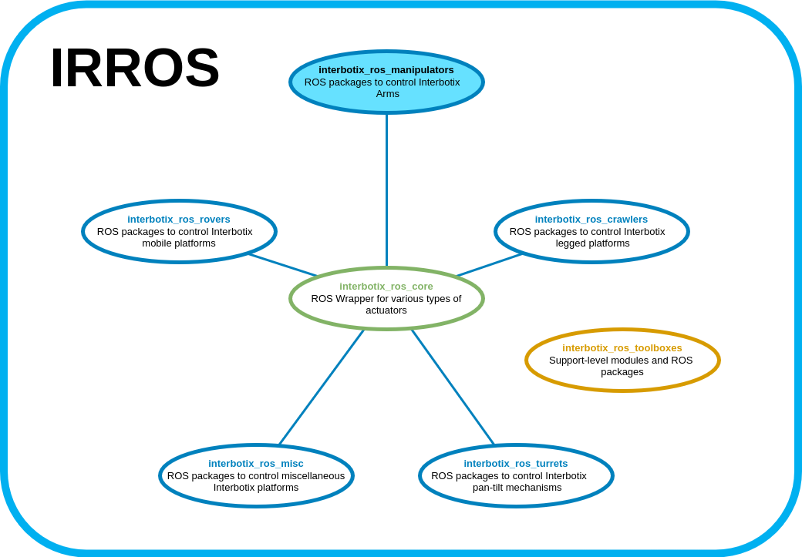

## Overview

Welcome to the *interbotix_ros_manipulators* repository! This repo contains custom ROS packages to control the various types of arms sold at [Interbotix](https://www.trossenrobotics.com/). These ROS packages build upon the ROS driver nodes found in the [interbotix_ros_core](https://github.com/Interbotix/interbotix_ros_core) repository. Support-level software can be found in the [interbotix_ros_toolboxes](https://github.com/Interbotix/interbotix_ros_toolboxes) repository.

## Repo Structure
```
GitHub Landing Page: Explains repository structure and contains a single directory for each type of manipulator.
├── Manipulator Type X Landing Page: Contains 'core' arm ROS packages.
│   ├── Core Arm ROS Package 1
│   ├── Core Arm ROS Package 2
│   ├── Core Arm ROS Package X
│   └── Examples: contains 'demo' arm ROS packages that build upon some of the 'core' arm ROS packages
│       ├── Demo Arm ROS Package 1
│       ├── Demo Arm ROS Package 2
│       ├── Demo Arm ROS Package X
│       └── Python Scripts: contains 'demo' Python scripts that build upon modules in the interbotix_ros_toolboxes repository
│           ├── Demo Python Script 1
│           ├── Demo Python Script 2
|           └── Demo Python Script X
├── LICENSE
└── README.md
```
As shown above, there are five main levels to this repository. To clarify some of the terms above, refer to the descriptions below.

- **Manipulator Type** - Any robotic arm that can use the same *interbotix_XXarm_control* package is considered to be of the same type. For the most part, this division lies on the type of actuator that makes up the robot. As an example, all the X-Series arms are considered the same type of manipulator since they all use various Dynamixel X-Series servos (despite the fact that they come in different sizes, DOF, and motor versions). However, a robotic arm made up of some other manufacturer's servos, or even half made up of Dynamixel servos and half made up of some other manufacturer's servos would be considered a different manipulator type.

- **Core Arm ROS Package** - This refers to 'High Profile' ROS packages that are essential to make a given arm work. Examples of 'High Profile' ROS packages include:
    - *interbotix_XXarm_control* - sets up the proper configurations and makes it possible to control the physical arm
    - *interbotix_XXarm_moveit* - sets up the proper configurations and makes it possible to control an arm via MoveIt
    - *interbotix_XXarm_gazebo* - sets up the proper configurations and makes it possible to control a Gazebo simulated arm
    - *interbotix_XXarm_ros_control*  - ROS control package used with MoveIt to control the physical arms
    - *interbotix_XXarm_descriptions* - contains URDFs and meshes of the arms, making it possible to visualize them in Rviz

- **Demo Arm ROS Package** - This refers to demo ROS packages that build upon the **Core Arm ROS Packages**. ROS researchers could use these packages as references to learn how to develop their own ROS packages and to get a feel for how the robot works. Typical demos for a given manipulator type include:
    - *interbotix_XXarm_joy* - manipulate an arm's end-effector using a joystick controller
    - *interbotix_XXarm_puppet* - make one or more 'puppet' arms copy the motion of a 'master' arm
    - *interbotix_XXarm_moveit_interface* - learn how to use MoveIt!'s MoveGroup Python or C++ APIs to control a robot arm

- **Demo Python Script** - This refers to demo Python scripts that build upon modules in the *interbotix_ros_toolboxes* repository. These modules essentially abstract away all ROS code, making it easy for a researcher with no ROS experience to interface with an arm as if it was just another Python object. It also makes sequencing robot motion a piece of cake.

Over time, the repo will grow to include more types of manipulators.

## Contributing
Feel free to send PRs to add features to currently existing Arm ROS packages or to include new ones. Note that all PRs should follow the structure and naming conventions outlined in the repo including documentation.

## Contributors
- [Solomon Wiznitzer](https://github.com/swiz23) - **ROS Engineer**
- [Levi Todes](https://github.com/LeTo37) - **CAD Engineer**
