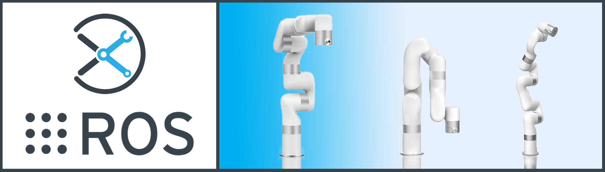
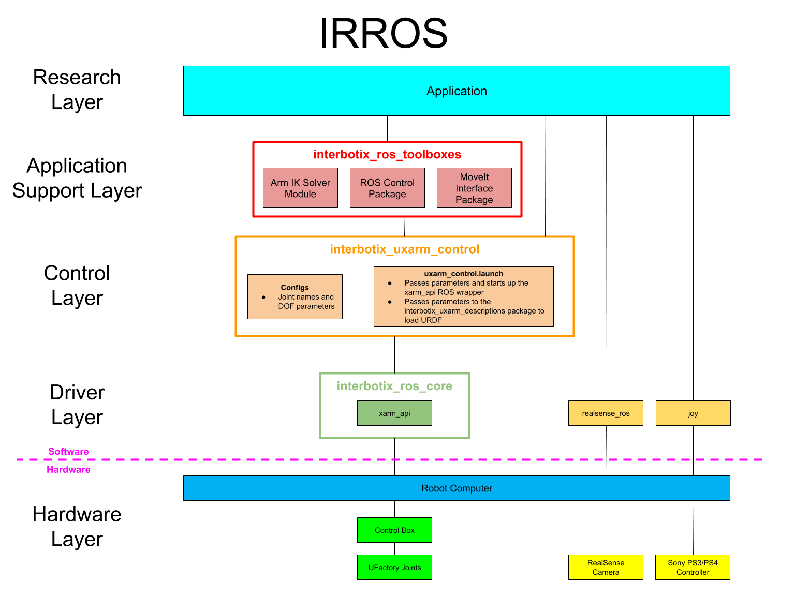
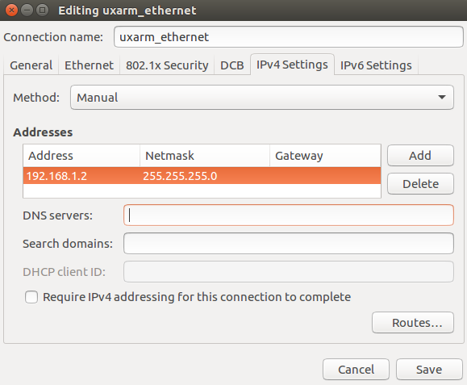

# Interbotix UFactory xArm ROS Packages

## Overview
Welcome to the *interbotix_ros_uxarms* sub-repo! This sub-repository contains ROS packages meant to be used with the three [UFactory xArm](https://www.trossenrobotics.com/xarm-6.aspx) robotic arms sold by Trossen Robotics. While ROS pacakges already exist to control these arms (created by the arm developers [here](https://github.com/xArm-Developer/xarm_ros)), the packages located in this sub-repo follow the [IRROS Standard](https://github.com/Interbotix/interbotix_ros_core#code-structure). Packages were tested on Ubuntu Linux 16.04, 18.04, and 20.04 using ROS Kinetic, Melodic, and Noetic respectively. Additionally, all ROS nodes were written using Python or C++. However, any programming language capable of sending ROS messages can be used to control the robots. To that effect, the core packages inside this repo are as follows:
- **interbotix_uxarm_moveit** - contains the config files necessary to launch an arm using MoveIt either in Gazebo, on the physical robot, or just in Rviz
- **interbotix_uxarm_gazebo** - contains the config files necessary to launch an arm in Gazebo, including tuned PID gains for ros_control
- **interbotix_uxarm_control** - contains the motor configuration files and the 'root' launch file that is responsible for launching the robot arm
- **interbotix_uxarm_ros_control** - contains the config files necessary to setup ROS controllers between MoveIt and the physical robot arm
- **interbotix_uxarm_descriptions** - contains the meshes and URDFs (including inertial models for the links) for all arm platforms

Finally, there is also an **examples** directory containing various demos of how the above mentioned core packages can be used. So what are you waiting for? Let's get started!

## IRROS Structure
Refer [here](https://github.com/Interbotix/interbotix_ros_core#code-structure) to get a general understanding of IRROS.

##### Hardware Layer
All xArms are made up of a lightweight carbon fiber material boasting powerful harmonic-driven joints with 17-bit resolution. They are powered with a 24V, 15A supply obtained from the Control Box. This box also contains the firmware necessary to take serial commands over Ethernet from a client's computer using the RS-485 protocol and adjust joint positions accordingly.

On the right side of this layer, there are two sensors. While the base robot kit from Interbotix does not come with either a RealSense camera or joystick controller, there are some demos (ROS packages in the Application layer) that may use them. For more information on this particular robot, refer to UFactory's website [here](https://ufactory.cc/pages/xarm).

##### Driver Layer
The ROS packages in this sub-repo build up from the *xarm_api* ROS wrapper found in the *interbotix_ros_core* repository. Reference the package there for implementation details. The *realsense_ros* and *joy* packages are ROS wrappers around the RealSense camera and PS3/PS4 controller devices respectively.

##### Control Layer
The *interbotix_uxarm_control* ROS package found in this layer holds the config files for each UFactory arm. These config files define the names of the joints that make up each arm as well as the arm's degrees of freedom. The launch file inside the package then passes the appropriate parameters to the *xarm_api* driver node depending on the type of arm being used.

##### Application Support Layer
The three main items shown in this layer can be found in the *interbotix_ros_toolboxes* repository [here](https://github.com/Interbotix/interbotix_ros_toolboxes/tree/main/interbotix_ux_toolbox). Specifically, the Arm IK Solver module can be found within the *interbotix_ux_modules* ROS package in a file called 'arm.py'. It essentially provides a small API to allow users to control an arm's end-effector in Python - no ROS experience necessary. Additionally, the *interbotix_ux_ros_control* and *interbotix_moveit_interface* packages make it possible for the *interbotix_uxarm_ros_control* and *interbotix_uxarm_moveit_interface* packages respectively to function properly.

##### Research Layer
All the ROS packages and Python scripts found within the [examples](examples/) directory fall in this category.

## Compatible Products
The ROS packages located here can be used with any of the Interbotix arm kits linked below. Next to each name is the name used to describe it in software (specifically for the `robot_model` argument in launch files). There are two parts in a name. Every name begins with 'uxarm' which is short for **U**Factory **xArm**. The last part of the name signifies the arm's degrees of freedom.
- [UFactory xArm5 Robot Arm](https://www.trossenrobotics.com/xarm-6.aspx) (uxarm5)
- [UFactory xArm6 Robot Arm](https://www.trossenrobotics.com/xarm-6.aspx) (uxarm6)
- [UFactory xArm7 Robot Arm](https://www.trossenrobotics.com/xarm-6.aspx) (uxarm7)

Note that at this time, all the links above redirect to the xArm6 Store page. If you'd like to purchase the 5 or 7 DOF variants, please contact us by phone or email (info available [here](https://www.trossenrobotics.com/contact.aspx)).

## Requirements
Below is a list of the hardware you will need to get started:
- Computer running Ubuntu Linux 16.04, 18.04, or 20.04 (note that virtual Linux machines have NOT been tested)
- One of the UFactory Robot Arm Kits mentioned above
- A sturdy place to mount the arm

## Hardware Setup
Please follow the Quick Start Guide that comes with the kit to properly setup the hardware. Note that the user will need to provide their own mounting solution for the arm. Also, keep in mind when plugging in the Ethernet cable to connect to the LAN port (not the RS-485 port) on the control box. For networking setup, either look at the instructions in the Quick Start Guide or reference sections 1.2.1 - 1.2.2 in the [User Manual](https://cdn.shopify.com/s/files/1/0012/6979/2886/files/xArm_User_Manual-1.6.0.pdf?v=1606880135). On Linux platforms, you should create a custom Ethernet network with a distinctive name (perhaps *uxarm_ethernet*). Make sure to go to the IPv4 tab and change...
- the **Method** field to Manual
- the **Addresses** field to include a static IP for your computer that begins with 192.168.1 and ends with any address that's not the control box's address; also set the Netmask to 255.255.255.0.

  

Confirm that the network is setup properly by trying to ping the control box. If you get data back, you're golden. Lastly, you'll want to verify that you have the latest firmware on the Control Box. Refer to Appendix 4 in the [User Manual](https://cdn.shopify.com/s/files/1/0012/6979/2886/files/xArm_User_Manual-1.6.0.pdf?v=1606880135) to do this.

## Software Setup
To get all the code setup, refer to the computer platform types below and run the appropriate installation script. Afterwards, continue with the [Post-Installation](#post-installation) sub-section.

###### AMD64 Architecture
If your computer uses an Intel or AMD based processor (which is the case for NUCs, most laptops and desktop computers), follow the commands below to download and run the installation script. Note that the script will also install the full desktop version of ROS (either Kinetic, Melodic, or Noetic) if it's not yet on your system.

    $ sudo apt install curl
    $ curl 'https://raw.githubusercontent.com/Interbotix/interbotix_ros_manipulators/main/interbotix_ros_uxarms/install/amd64/uxarm_amd64_install.sh' > uxarm_amd64_install.sh
    $ chmod +x uxarm_amd64_install.sh
    $ ./uxarm_amd64_install.sh

###### Raspberry Pi 4B (ARM64 Architecture)
If you purchased a Raspberry Pi 4B Kit with an arm from our website, there is no need to install anything as the Pi should already come preloaded with all the necessary software. If you purchased your own Raspberry Pi 4B from a third party, feel free to follow the instructions [here](https://github.com/Interbotix/interbotix_ros_toolboxes/blob/main/interbotix_rpi_toolbox/README.md) to get it properly setup before following the commands below. If you only purchased the stand-alone Raspberry Pi 4B Kit from our store (which comes pre-configured with Ubuntu and ROS), and would like to use it with an arm, then follow the commands below to download and run the installation script. Note that the script will install the full desktop version of ROS if it's not yet on your system. Note that there is no difference between this script and the AMD64 one except that the RPI4 script allows some RPI4 specific modules to be used.

    $ sudo apt install curl
    $ curl 'https://raw.githubusercontent.com/Interbotix/interbotix_ros_manipulators/main/interbotix_ros_uxarms/install/rpi4/uxarm_rpi4_install.sh' > uxarm_rpi4_install.sh
    $ chmod +x uxarm_rpi4_install.sh
    $ ./uxarm_rpi4_install.sh

##### Remote Install
For some robotic projects, you may want to run your robot in a 'headless' state on some computer (like a NUC or Raspberry Pi), and monitor the robot's state (in Rviz for example) on your personal (a.k.a remote) computer over a local network. For this to work, run the installation script below on your personal Linux computer. Note that ROS and Rviz must already be installed! As an FYI, the script will prompt you to insert the hostname of the robot (NOT the remote) computer. As an example, if you wanted to monitor the state of a robot arm purchased with a Raspberry Pi 4B Kit, you would set the hostname to `pibot`. To find out the hostname of the robot computer, just open a terminal and type `hostname`

    $ sudo apt install curl
    $ curl 'https://raw.githubusercontent.com/Interbotix/interbotix_ros_manipulators/main/interbotix_ros_uxarms/install/uxarm_remote_install.sh' > uxarm_remote_install.sh
    $ chmod +x uxarm_remote_install.sh
    $ ./uxarm_remote_install.sh

Be aware that the installation script will export the ROS_MASTER_URI environment variable in your personal computer's ~/.bashrc file to `http://<hostname>.local:11311`. Make sure to comment out this line when done monitoring or your personal computer will complain about not being able to find its ROS Master.

##### Post Installation
For ROS Melodic users, open the following Gazebo config file to fix an issue described [here](https://answers.gazebosim.org//question/25030/gazebo-error-restcc205-error-in-rest-request/).

    $ nano ~/.ignition/fuel/config.yaml

Now change the url inside from `https://api.ignitionfuel.org` to `https://api.ignitionrobotics.org`.

## Quickstart

1. Get familiar with the virtual robot model by launching it in Rviz and playing with the *joint_state_publisher*. Note that you must specify which arm model is being used as a command line argument. For example, the xArm7 robot arm can be launched as follows:

        $ roslaunch interbotix_uxarm_descriptions uxarm_description.launch robot_model:=uxarm7 use_joint_pub_gui:=true

2. Get familiar with the physical robot arm (let's say... a uxarm6 with an IP address of 192.168.1.200) by executing the following command in the terminal (Ctrl-C from Step 1 first):

        $ roslaunch interbotix_uxarm_control uxarm_control.launch robot_model:=uxarm6 robot_ip:=192.168.1.200

3. By default, all the motors in the robot are disabled. Enable them by typing the following command in a terminal:

        $ rosservice call /uxarm6/motion_ctrl 8 1

4. Now set the Operating Mode to 0. This will enable you to command joint positions at specific velocities and accelerations. After setting the Mode to 0, you also have to change the State of the robot to 'Ready'. This is done by setting the State to 0.

        $ rosservice call /uxarm6/set_mode 0
        $ rosservice call /uxarm6/set_state 0

5. Move the robot to its 'Hold-Up' pose with a max joint velocity of 0.35 rad/s and acceleration of 2 rad/s^2 by:

        $ rosservice call /uxarm6/move_joint [0,0,0,0,-1.57,0] 0.35 2.0 0 0

6. Finally, let's go to Zero Gravity Mode! This will allow you to manually move the arm wherever you want.

        $ rosservice call /uxarm6/set_mode 2
        $ rosservice call /uxarm6/set_state 0

7. If the above command doesn't work, it's possible the robot has gone into an error state. You can check to see what the error code is by calling the service below. If the result is not 0, then there is an issue.

        $ rosservice call /uxarm6/get_err

8. Fix it by clearing the error message and repeating Step 6...

        $ rosservice call /uxarm6/clear_err

That ends the quickstart tutorial. To get familiar with the architecture and launch file arguments, refer to the READMEs of the core packages. Start with the [interbotix_uxarm_descriptions](interbotix_uxarm_descriptions/) package, then the [interbotix_uxarm_control](interbotix_uxarm_control/) package. Next, look at the [interbotix_uxarm_gazebo](interbotix_uxarm_gazebo/) package followed by the [interbotix_uxarm_ros_control](interbotix_uxarm_ros_control/) and [interbotix_uxarm_moveit](interbotix_uxarm_moveit/) packages. This is the most logical approach to take to gain a better understanding of how they relate to each other. Afterwards, feel free to check out the demo projects in the [examples](examples/) directory.

## Troubleshooting
Feel free to contact us as trsupport@trossenrobotics.com or submit an Issue. We strongly recommend the latter option though so that other people who may be facing the same difficulty can benefit. This repository is actively maintained and any open Issues will be addressed as soon as possible.

## Contributing
If you'd like to contribute your own [example ROS package](examples/) or custom [Python script](examples/python_demos), just make sure to follow the same outline/structure as the other packages/scripts. This includes maintaining naming convention, and documentation.

## Contributors
- [Solomon Wiznitzer](https://github.com/swiz23) - **ROS Engineer**
- [xArm Developers](https://github.com/xArm-Developer/xarm_ros) - **CAD Engineers**
