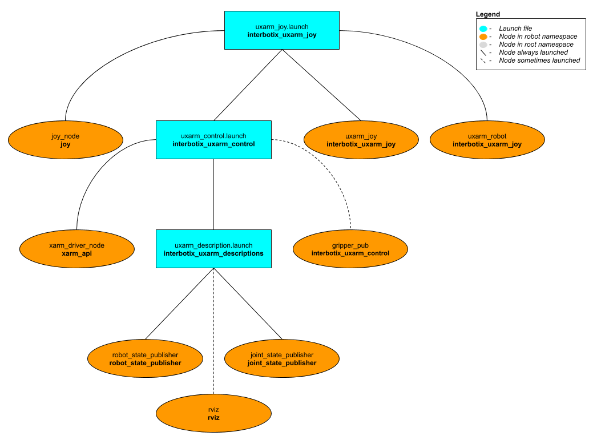

# interbotix_uxarm_joy

## Overview
This package can be used to control the movements of any UFactory xArm using a SONY PS3/PS4 controller or Microsoft Xbox360 controller (untested) via Bluetooth. In this demo, the 'arm' joints are set to work in Mode 1 (servo mode) except when going to the Home or Hold-Up poses which work in Mode 0 (pose mode). Refer to the joystick button map below to see how to operate the robot. Specifically, this package performs 'inverse kinematics' on all the joints to get the end-effector of the robot (defined at the end of the arm - before the gripper) to move as if it's in Cartesian space. This is done using a combination of the [modern_robotics](https://github.com/NxRLab/ModernRobotics/tree/master/packages/Python) code library offered by Northwestern University (to do some forward kinematics) and the *move_servo_cart* ROS Service created by the xArm Developers (to do inverse kinematics).

## Structure

As shown above, the *interbotix_uxarm_joy* package builds on top of the *interbotix_uxarm_control* package. To get pointers about the nodes in that package, please look at its README. The other nodes are described below:
- **joy** - a ROS driver for a generic Linux joystick; it reads data from a joystick over Bluetooth and publishes  [sensor_msgs/Joy](http://docs.ros.org/melodic/api/sensor_msgs/html/msg/Joy.html) messages to the `commands/joy_raw` topic
- **uxarm_joy** - responsible for reading in raw [sensor_msgs/Joy](http://docs.ros.org/melodic/api/sensor_msgs/html/msg/Joy.html) messages from the `commands/joy_raw` topic and converting them into [ArmJoy](msg/ArmJoy.msg) messages; this makes the code more readable and allows users to remap buttons very easily later
- **uxarm_robot** - responsible for reading in [ArmJoy](msg/ArmJoy.msg) messages and sending joint and gripper commands to the **xarm_driver_node** node

## Bluetooth Setup
#### Sony PS4 Controller (Recommended)
Getting a PS4 controller connected via Bluetooth to a Linux laptop is pretty straightforward. Click the *Bluetooth* icon on the top right of your screen, followed by *Bluetooth Settings...*. Next, press and hold the *Share* button on the PS4 controller (see image below for reference). While holding the *Share* button, press and hold the *PS* button. After a few seconds, the triangular shaped LED located between the *L2* and *R2* buttons should start rapidly flashing white (about twice a second) at which point you can let go.

On the computer, click the '+' icon in the *Bluetooth* settings window. Wait until you see 'Wireless Controller' pop up, select it, and click *Next* on the bottom right of the window. A message should display saying 'successfully set up new device 'Wireless Controller'' and the LED should turn blue. This means the controller is connected to the computer. To disconnect, hold down the *PS* button for about 10 seconds until the LED turns off. To reconnect, just press the *PS* button (no need to hold it down). After blinking white a few times, the LED should turn blue.


##### Sony PS3 Controller
Getting a PS3 controller connected via Bluetooth to a Linux laptop can be a bit finicky at times. However, the commands below should do the trick. Get an original SONY PS3 controller, it's accompanying USB cable, and open up a terminal. Type:
```
$ sudo bluetoothctl
[bluetooth]# power on
[bluetooth]# agent on
[bluetooth]# scan on
```
Now, plug the PS3 controller into the Linux Laptop. At this point, a message should pop up in the terminal that looks something like the following (with a different MAC address):
```
[NEW] Device FC:62:B9:3F:79:E7 PLAYSTATION(R)3 Controller
```
When it appears, type:
```
[bluetooth]# trust <MAC-address>
```
Now unplug the PS3 controller and press the PS button. The four red LEDs at the front of the controller should flash a few times, eventually leaving just one LED on by the '1'. This means that the joystick paired successfully.

Sometimes, the joystick might cause the cursor of the computer mouse to go crazy. To fix this, add the following line to the `~/.bashrc` file:
```
alias joy_stop='xinput set-prop "PLAYSTATION(R)3 Controller" "Device Enabled" 0'
```
Now, whenever the PS3 joystick is paired to the computer, just type `joy_stop` in the terminal to stop it messing with the mouse (you're welcome).

## Usage
After pairing the joystick, type the following in a terminal (let's say to control the xArm6 with gripper at an IP of 192.168.1.34). Note that in this case, we're offsetting the end-effector to be between the gripper fingers instead of the end of the arm (approximately by 14 cm):
```
roslaunch interbotix_uxarm_joy uxarm_joy.launch robot_model:=uxarm6 use_gripper:=true robot_ip:=192.168.1.34 ee_offset:=[0,0,0.14,0,0,0]
```
A red error message might appear in the screen saying `Couldn't open joystick force feedback!`. This is normal and will not affect the joystick operation. To further customize the launch file at run-time, look at the table below:

| Argument | Description | Default Value |
| -------- | ----------- | :-----------: |
| robot_model | model type of the Interbotix Arm such as 'uxarm5' or 'uxarm6' | "" |
| robot_name | name of the robot (typically equal to `robot_model`, but could be anything) | "$(arg robot_model)" |
| base_link_frame | name of the 'root' link on the arm; typically 'base_link', but can be changed if attaching the arm to a mobile base that already has a 'base_link' frame| 'base_link' |
| use_gripper | if true, the **gripper_pub** node is launched which publishes the gripper joint state | false |
| show_gripper | if true, the gripper is included in the 'robot_description' parameter; if false, the gripper is not loaded to the parameter server. Set to false if you have a custom gripper attachment or are not using a gripper | $(arg use_gripper) |
| use_world_frame | set this to true if you would like to load a 'world' frame to the 'robot_description' parameter which is located exactly at the 'base_link' frame of the robot; if using multiple robots or if you would like to attach the 'base_link' frame of the robot to a different frame, set this to false | true |  
| external_urdf_loc | the file path to the custom urdf.xacro file that you would like to include in the Interbotix robot's urdf.xacro file| "" |
| use_rviz | launches Rviz | true |
| robot_ip | IP address of the xArm's Control Box | "" |
| gripper_pub_freq | Rate at which the gripper joint state should be published | 10 |
| threshold | value from 0 to 1 defining joystick sensitivity; a larger number means the joystick should be less sensitive | 0.75 |
| controller | type of controller ('ps3', 'ps4', or 'xbox360') | ps4 |
| ee_offset | [x, y, z, roll, pitch, yaw] (m / rad) to offset the end-effector from its default pose; the 'z' component should be set to 0.14 if using a gripper (this places the end-effector roughly between the fingers) | [0,0,0,0,0,0] |
| launch_driver | true if the *uxarm_control.launch* file should be launched - set to false if you would like to run your own version of this file separately | true |

To understand how the joystick buttons map to controlling the robot, look at the diagram and table below. Note that while the Xbox360 has a slightly different naming convention, the button placement is essentially the same:


| Button | Action |
| ------ | ------ |
| START/OPTIONS | move robot arm to its Home pose |
| SELECT/SHARE | move robot arm to its Hold-Up pose |
| R2 | rotate the end-effector clockwise around the base |
| L2 | rotate the end-effector counterclockwise around the base |
| Triangle | increase gripper pressure in single step increments (max is 35)|
| X | decrease gripper pressure in single step increments (min is 15)|
| O | open gripper |
| Square | close gripper |
| D-pad Up | increase joint speed in single step increments (max of 20) |
| D-pad Down | decrease joint speed in single step increments (min of 0) |
| D-pad Left | 'coarse' control - sets the joint speed to a user-preset 'fast' speed |
| D-pad Right | 'fine' control - sets the joint speed to a user-preset 'slow' speed |
| Right stick Up/Down | increase/decrease pitch of the end-effector |
| Right stick Left/Right | increase/decrease yaw of the end-effector |
| R3 | reverses the Right stick Left/Right control |
| Left stick Up/Down | move the end-effector vertically in Cartesian space |
| Left stick Left/Right | move the end-effector horizontally in Cartesian space |
| L3 | reverses the Left stick Left/Right control |
| PS | if in Mode 1 (servo mode), holding for 3 seconds will put the robot in Mode 2 (teach or 'zero-gravity' mode); if in Mode 2, tapping the button will put the robot in Mode 1 |
