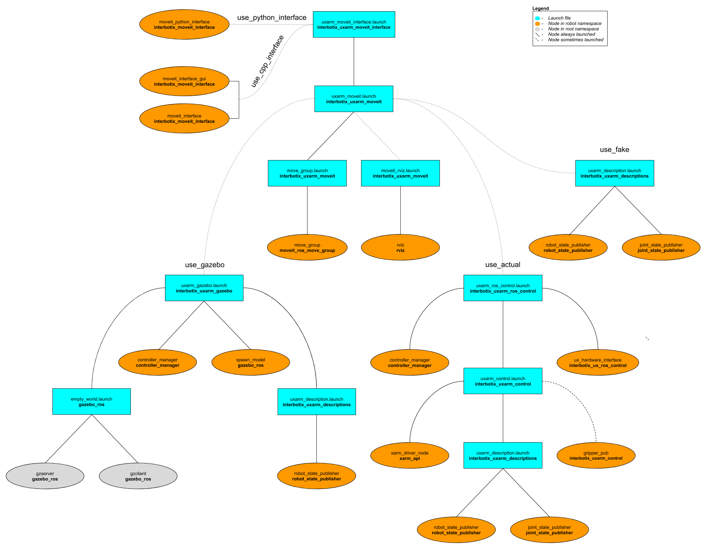
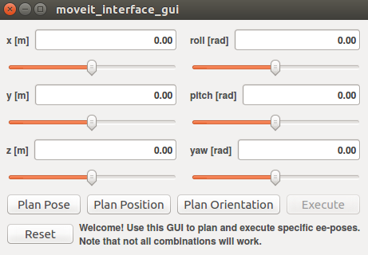

# interbotix_uxarm_moveit_interface

## Overview
This package contains a small API modeled after the [Move Group C++ Interface Tutorial](https://github.com/ros-planning/moveit_tutorials/blob/kinetic-devel/doc/move_group_interface/src/move_group_interface_tutorial.cpp) that allows a user to command desired end-effector poses to a UFactory xArm. It is not meant to be all-encompassing but rather should be viewed as a starting point for someone interested in creating their own MoveIt interface to interact with an arm. The package also contains a small GUI that can be used to pose the end-effector.

Finally, this package also contains a modified version of the [Move Group Python Interface Tutorial](https://github.com/ros-planning/moveit_tutorials/blob/kinetic-devel/doc/move_group_python_interface/scripts/move_group_python_interface_tutorial.py) script that can be used as a guide for those users who would like to interface with an Interbotix robot via the MoveIt Commander Python module.

## Structure

As shown above, this package builds on top of of the *interbotix_uxarm_moveit* package. To get familiar with that package, please refer to its README. The *interbotix_uxarm_moveit_interface* nodes are described below:
- **moveit_interface** - a small C++ API that makes it easier for a user to command custom poses to the end-effector of any arm; it uses MoveIt's planner behind the scenes to generate desired joint trajectories;
- **moveit_interface_gui** - a GUI (modeled after the one in the *joint_state_publisher_gui* package) that allows a user to enter in desired end-effector poses via text fields or sliders; it uses the **moveit_interface** API to plan and execute trajectories
- **moveit_python_interface** - a modified version of the script used in the [Move Group Python Interface](http://docs.ros.org/kinetic/api/moveit_tutorials/html/doc/move_group_python_interface/move_group_python_interface_tutorial.html) tutorial that is meant to work with any arm; just press 'Enter' in the terminal to walk through the different steps; the desired joint state goal, pose goal, and end-effector offset (when attaching the box) are stored in YAML files located in the [config](config/) directory

Note that all the nodes defined above live in the [interbotix_ros_toolboxes](https://github.com/Interbotix/interbotix_ros_toolboxes/tree/main/interbotix_common_toolbox/interbotix_moveit_interface) sub-repo. That is because these nodes, besides for being used here, are also used in other repositories (like *interbotix_ros_rovers*). To make it easier to maintain, it made more sense to keep one instance of them in the toolbox repository instead of having duplicates in multiple repositories.

## Usage
To run this package on the physical robot, type the line below in a terminal (assuming the xArm7 is being launched without a gripper at an IP of 192.168.1.23). Note that if you're using a 4 or 6 dof arm, you should set the `dof` launch file argument appropriately.
```
$ roslaunch interbotix_uxarm_moveit_interface uxarm_moveit_interface.launch robot_model:=uxarm7 use_cpp_interface:=true use_actual:=true dof:=7
```
A GUI should pop-up similar to the one below. In it, a user should specify the desired position and orientation of the end-effector. This can be done either via the slider bars or by entering values into the text fields. Next, a user can press one of five buttons. They are:
- **Plan Pose** - MoveIt will attempt to find a trajectory that places the end-effector at the desired position and orientation
- **Plan Position** - MoveIt will attempt to find a trajectory that places the end-effector at the desired position, ignoring orientation
- **Plan Orientation** - MoveIt will attempt to find a trajectory that places the end-effector at the desired orientation, ignoring position; note that the planner fails more often than not for this option
- **Execute** - Once a valid plan has been found, this button can be pressed to actually execute the trajectory on the robot
- **Reset** - This resets all slider bars to the middle and text fields to '0.00'

Note that occasionally, MoveIt will be unsuccessful in finding a valid trajectory. This could be for one of two reasons. Either the desired pose is not physically attainable by the arm or the random seed generated by MoveIt was a bad guess. If it is clear that the pose is physically attainable, try hitting the desired 'Plan' button a few more times.

<p align="center">
  
</p>

This is the bare minimum needed to get up and running. Take a look at the table below to see how to further customize with other launch file arguments.

| Argument | Description | Default Value |
| -------- | ----------- | :-----------: |
| robot_model | model type of the Interbotix Arm such as 'uxarm5' or 'uxarm6' | "" |
| robot_name | name of the robot (typically equal to `robot_model`, but could be anything) | "$(arg robot_model)" |
| base_link_frame | name of the 'root' link on the arm; typically 'base_link', but can be changed if attaching the arm to a mobile base that already has a 'base_link' frame| 'base_link' |
| use_gripper | if true, the **gripper_pub** node is launched which publishes the gripper joint state | false |
| show_gripper | if true, the gripper is included in the 'robot_description' parameter; if false, the gripper is not loaded to the parameter server. Set to false if you have a custom gripper attachment or are not using a gripper | $(arg use_gripper) |
| use_world_frame | set this to true if you would like to load a 'world' frame to the 'robot_description' parameter which is located exactly at the 'base_link' frame of the robot; if using multiple robots or if you would like to attach the 'base_link' frame of the robot to a different frame, set this to false | true |  
| external_urdf_loc | the file path to the custom urdf.xacro file that you would like to include in the Interbotix robot's urdf.xacro file| "" |
| external_srdf_loc | the file path to the custom srdf.xacro file that you would like to include in the Interbotix robot's srdf.xacro file. Note that this should only contain 'disable collision' tags for collisions between the original Interbotix Arm and other links that are defined in the file specified by `external_urdf_loc` | "" |
| use_moveit_rviz | a boolean that if true, displays Rviz with the MoveIt plugin; if false, MoveIt runs in a headless state | true |
| rviz_frame | defines the fixed frame parameter in Rviz. Note that if 'use_world_frame' is False, this parameter should be changed to a frame that exists | world |
| robot_ip | IP address of the xArm's Control Box | "" |
| gripper_pub_freq | Rate at which the gripper joint state should be published | 10 |
| use_gazebo | launch MoveIt with a Gazebo simulated robot | false |
| use_actual | launch MoveIt with the physical robot | false |
| use_fake | launch MoveIt with a MoveIt generated fake robot | false |
| dof | the degrees of freedom of the arm (either 5, 6, or 7) | 5 |
| world_name | the file path to the Gazebo 'world' file to load (if simulating) | refer to [uxarm_moveit.launch](launch/uxarm_moveit.launch) |
| use_cpp_interface | launch the custom **moveit_interface** C++ API node | false |
| moveit_interface_gui | launch a custom GUI to interface with the **moveit_interface** node so that the user can command specific end-effector poses (end of the arm before the gripper) | true |
| use_python_interface | launch the Python Interface Tutorial node | false |
