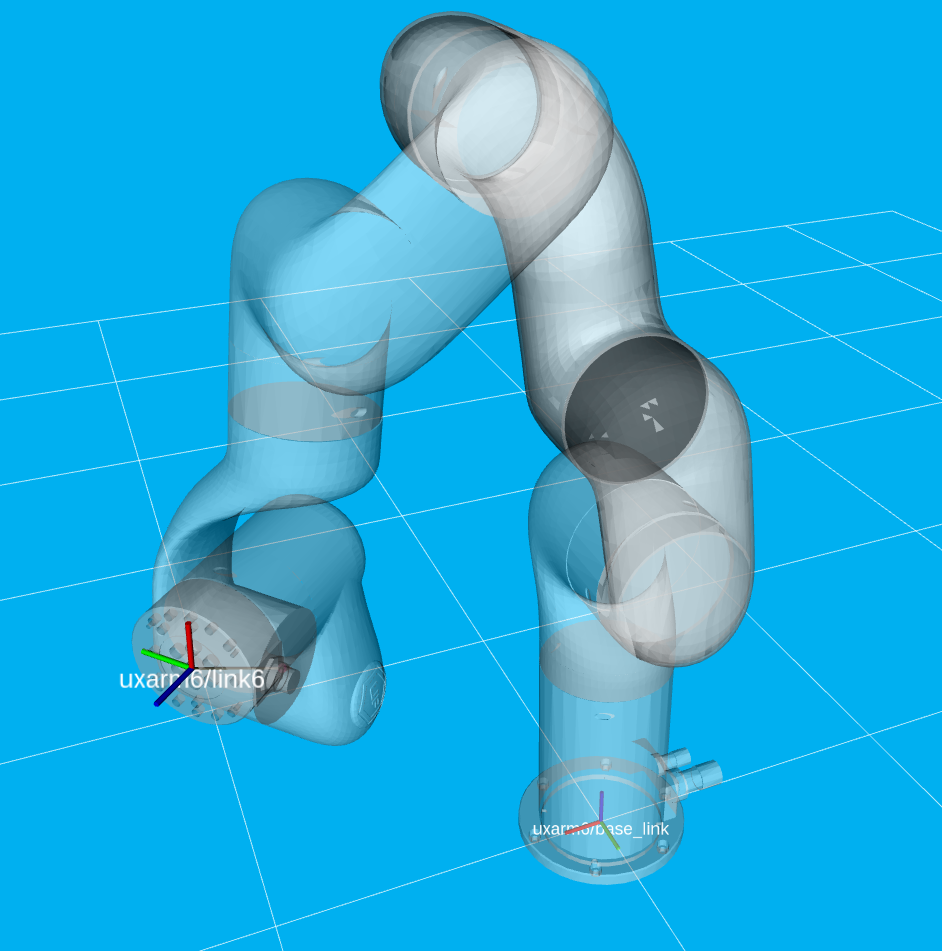
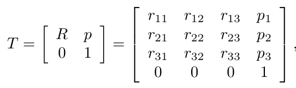

# Interbotix UFactory xArm Python API Demos

## Overview
This directory showcases various ways of using the [Interbotix Python Arm Module](https://github.com/Interbotix/interbotix_ros_toolboxes/blob/main/interbotix_ux_toolbox/interbotix_ux_modules/src/interbotix_ux_modules/arm.py) (click the link to see the fully documented code; also check out the [interbotix_ux_modules](https://github.com/Interbotix/interbotix_ros_toolboxes/tree/main/interbotix_ux_toolbox/interbotix_ux_modules) package to get a better understanding on how this and other modules can be used). Simply put, this API was created so that users with little to no ROS experience would still have the ability to control any UFactory xArm supported by the *xarm_api*. Specifically, the API also allows a user to make an arm go to desired end-effector poses or follow Cartesian trajectories. This last feature was made possible by the [Modern Robotics: Mechanics, Planning, and Control Code Library](https://github.com/NxRLab/ModernRobotics) created at Northwestern University. Alternatively, the xArm's API can be used directly by just loading the [Interbotix Python Core Module](https://github.com/Interbotix/interbotix_ros_toolboxes/blob/main/interbotix_ux_toolbox/interbotix_ux_modules/src/interbotix_ux_modules/core.py).

For the API to work, the arm joints mainly work in Mode 0 (pose mode). However, when following Cartesian trajectories, the mode is changed to Mode 1 (servo mode).

## Structure


The Python Arm module (located in the *interbotix_ux_modules* ROS package) builds on top of the *xarm_api* package. To get familiar with the other nodes in the graph above, look at the various packages READMEs.
- **robot_manipulation** - a ROS node (operating 'behind the scenes') that takes in commands entered via the Python API and calls the appropriate ROS services when necessary. It is not a classic ROS node in the sense that it can't be launched from a ROS launch file or run from the terminal using a `rosrun` command. Rather, the Python API module contains a Class that when instantiated, gives the node life. At the completion of a program, the object gets destroyed, killing the node.

## Terminology
<p align="center">
  
</p>

Before getting started with the Python API, it is important to understand some terminology. First off, end-effector poses are specified from */<robot_name>/linkX* (a.k.a the 'Body' frame where 'X' is the last link on the robot OR offset from that frame by the `ee_offset` parameter) to */<robot_name>/base_link* (a.k.a the 'Space' frame). In the code documentation, this transform is knows as **T_sb** (i.e. the transform that specifies the 'Body' frame 'b' in terms of the 'Space' frame 's'). It goes without saying that the 'red' axis is the 'X-frame', the 'green' axis is the 'Y-frame', and the 'blue' axis is the 'Z-frame'. The way this information is stored is via a transformation matrix as shown below.

<p align="center">
  
</p>

In the image above, the first three rows and three columns define a 3-dimensional rotation matrix that describes the orientation of the 'Body' frame with respect to the 'Space' frame. On the other hand, the first three rows and the fourth column of the matrix represent the translational position (i.e. xyz) of the 'Body' frame with respect to the 'Space' frame. Finally, the fourth row of the matrix is always [0 0 0 1] for matrix multiplication purposes. Besides for seeing **T_sb** in the code documentation, you will also see **T_sd**. The main difference between these two transforms is that **T_sb** defines the current end-effector pose whereas **T_sd** defines the desired ('d') end-effector pose with respect to the 'Space' frame. If using the `set_ee_pose_matrix` function, **T_sd** is what you should be specifying.

Some of us though prefer not to think in terms of transformation or rotation matrices. That's where the `set_ee_pose_components` function comes in handy. In this function, you define **T_sd** in terms of the components it represents - specifically the x, y, z, roll, pitch, and yaw of the 'Body' frame with respect to the 'Space' frame (where x, y, and z are in meters, and roll, pitch and yaw are in radians).

As an FYI, if you set two end-effector poses in a row (with either of the functions discussed above) where the only difference is that the 'x' component is shifted by 0.2 meters, the end-effector will NOT follow a straight-line path, but rather a curved one. This makes it difficult to perform movements that are 'orientation-sensitive' (like carrying a small cup of water without spilling). To get around this, there is the `set_ee_cartesian_trajectory` function! This function essentially defines waypoints that the end-effector should follow as it travels from its current pose to the desired pose such that it moves in a straight line. The number of waypoints generated depends on the duration of the trajectory (a.k.a **moving_time**) along with the period of time between waypoints (a.k.a **wp_period**). For example, if the whole trajectory should take 2 seconds and the waypoint period is 0.05 seconds, there will be a total of 2/0.05 = 40 waypoints. In general, the **wp_period** should be approximately 0.02 seconds to assure smooth motion. If it's too high, movement might be jerky. Too low will also give smooth motion, but take up unnecessary processing time.

There are two other things to note about the `set_ee_cartesian_trajectory` function. The first thing is that this function accepts *relative* values only. So if the end-effector is located at xyz = [0.2, 0, 0.2], and then the function is called with 'z=0.3' as the argument, the new pose will be xyz = [0.2, 0, 0.5]. The second thing is that end-effector poses are defined with respect to a virtual frame called **T_sy**. This frame has the exact same x, y, z, roll, and pitch as the 'Space' frame. However, it contains the 'yaw' of the 'Body' frame. Thus, if the end-effector is located at xyz = [0.2, 0.2, 0.2] with respect to the 'Space' frame, this converts to xyz = [0.2828, 0, 0.2] with respect to the **T_sy** frame. Now, if I want the end-effector to move 0.3 meters along the X-axis of **T_sy**, I can call the function with 'x=0.3' as the argument, and it will move to xyz = [0.5828, 0, 0.2] with respect to **T_sy**. This way, you only have to think in 1 dimension. However, if the end-effector poses were defined in the 'Space' frame, then relative poses would have to be 2 dimensional. For example, the pose equivalent to the one above with respect to the 'Space' frame would have to be defined as xyz = [0.412, 0.412, 0.2].

Thus, in my opinion, the best way to control an arm from its Sleep pose is as follows:
- Command the arm to go to its Hold-Up pose
- Command the waist joint until the end-effector is pointing in the desired direction
- Command the end-effector using the `set_ee_cartesian_trajectory` function as many times as necessary to do a task (pick, place, pour, etc...)
- Repeat the above two steps as necessary
- Command the arm to its Hold-Up pose
- Command the arm to its Home pose

 One other thing to note is that the end-effector should not be pitched to exactly +/-90 degrees as that can lead to funky things happening... In any event, feel free to refer to the [bartender](bartender.py) script to see the above method put into action.

## Usage
To get started, open up a terminal and type (assuming an xArm6 with gripper at an IP of 192.168.1.232 is being launched)...
```
roslaunch interbotix_uxarm_control uxarm_control.launch robot_model:=uxarm6 use_gripper:=true robot_ip:=192.168.1.232
```
In another terminal, navigate to this directory and type...
```
python bartender.py        # python3 bartender.py if using ROS Noetic
```
You should observe the robot pick up a virtual bottle (from behind a virtual bar), rotate so that the end-effector is facing the opposite direction, pour a virtual drink (on the virtual bar), then place the 'bottle' down, and go to its Home pose.

The other scripts work in a similar fashion, but you must make sure to change the robot name in the file to the arm you have. You might also have to adjust the commanded poses/trajectories if working with arms with fewer dof as some of them might by physically unattainable. To make things easier, each script also outlines the commands necessary to get the robot moving!
