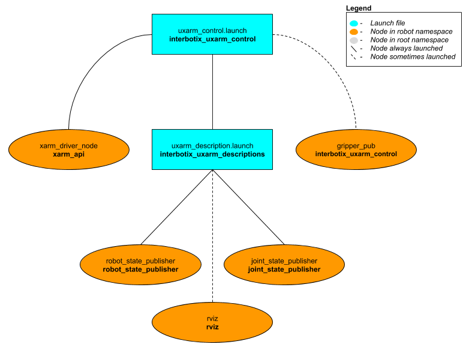

# interbotix_uxarm_control

## Overview
This package contains the configuration and launch files necessary to easily start the UFactory xArm platform. This includes launching the **xarm_driver_node** node responsible for driving the motors on the robot and loading the URDF to the `robot_description` parameter. Essentially, this package is what all 'downstream' ROS packages should reference to get the robot up and running.

## Structure


As shown in the image above, the *interbotix_uxarm_control* package builds on top of the [interbotix_uxarm_descriptions](../interbotix_uxarm_descriptions) and [xarm_api](https://github.com/Interbotix/interbotix_ros_core/tree/main/interbotix_ros_uxarms/xarm_api) packages. Please take a look at those packages to get familiar with their nodes. You will also notice a [config](config/) directory containing some YAML files. Each file specifies the names for all the motors that make up a specific robot arm, along with the arm's degrees of freedom. Additionally, this package contains one node.
- **gripper_pub** - publishes the joint state for the gripper (which the **xarm_api** node does not do for some reason)

## Usage
To run this package on the physical robot, type the line below in a terminal (assuming the xArm5 arm is being used with a Control Box IP address of 192.168.1.17).
```
roslaunch interbotix_uxarm_control uxarm_control.launch robot_model:=uxarm5 robot_ip:=192.168.1.17
```

To further customize the launch file at run-time, refer to the table below.

| Argument | Description | Default Value |
| -------- | ----------- | :-----------: |
| robot_model | model type of the Interbotix Arm such as 'uxarm5' or 'uxarm6' | "" |
| robot_name | name of the robot (typically equal to `robot_model`, but could be anything) | "$(arg robot_model)" |
| base_link_frame | name of the 'root' link on the arm; typically 'base_link', but can be changed if attaching the arm to a mobile base that already has a 'base_link' frame| 'base_link' |
| use_gripper | if true, the **gripper_pub** node is launched which publishes the gripper joint state | false |
| show_gripper | if true, the gripper is included in the 'robot_description' parameter; if false, the gripper is not loaded to the parameter server. Set to false if you have a custom gripper attachment or are not using a gripper | $(arg use_gripper) |
| use_world_frame | set this to true if you would like to load a 'world' frame to the 'robot_description' parameter which is located exactly at the 'base_link' frame of the robot; if using multiple robots or if you would like to attach the 'base_link' frame of the robot to a different frame, set this to false | true |  
| external_urdf_loc | the file path to the custom urdf.xacro file that you would like to include in the Interbotix robot's urdf.xacro file| "" |
| use_rviz | launches Rviz | true |
| robot_ip | IP address of the xArm's Control Box | "" |
| gripper_pub_freq | Rate at which the gripper joint state should be published | 10 |
