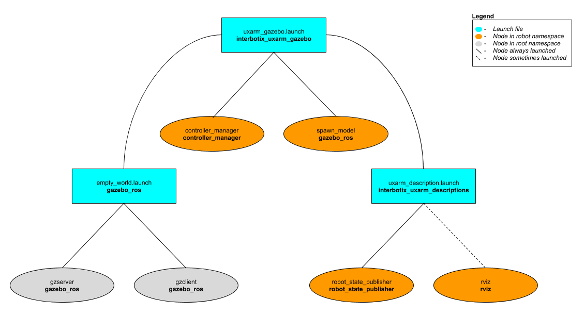

# interbotix_uxarm_gazebo

## Overview
This package contains the necessary config files to get any UFactory xArm simulated in Gazebo. Specifically, it contains the [uxarm_configs.gazebo](config/uxarm_configs.gazebo) file which allows the texture of the robotic arms to display properly and the [uxarm_gripper_configs.gazebo](config/uxarm_gripper_configs.gazebo) file which is used to load the mimic joint plugin correctly. It also contains YAML files with tuned PID gains for the arm and gripper joints so that ros_control can control the arms effectively. This package has one of two applications. It can either be used in conjunction with MoveIt via the FollowJointTrajectory interface or it can be used by itself via the JointPositionController interface.

## Structure

As shown above, the *interbotix_uxarm_gazebo* package builds on top of the *interbotix_uxarm_descriptions* and *gazebo_ros* packages. To get familiar with the nodes in the *interbotix_uxarm_descriptions* package, please look at its README. The other nodes are described below:
- **gzserver** - responsible for running the physics update-loop and sensor data generation
- **gzclient** - provides a nice GUI to visualize the robot simulation
- **controller_manager** - responsible for loading and starting a set of controllers at once, as well as automatically stopping and unloading those same controllers
- **spawn_model** - adds the robot model as defined in the 'robot_description' parameter into the Gazebo world

## Usage
To run this package, type the line below in a terminal (assuming the xArm6 and gripper are being launched with position controllers).
```
$ roslaunch interbotix_uxarm_gazebo uxarm_gazebo.launch robot_model:=uxarm6 show_gripper:=true use_position_controllers:=true dof:=6
```

Since by default, Gazebo is started in a 'paused' state (this is done to give time for the controllers to kick in), unpause the physics once it is fully loaded by typing:
```
$ rosservice call /gazebo/unpause_physics
```
This is the bare minimum needed to get up and running. Take a look at the table below to see how to further customize with other launch file arguments.

| Argument | Description | Default Value |
| -------- | ----------- | :-----------: |
| robot_model | model type of the Interbotix Arm such as 'uxarm5' or 'uxarm6' | "" |
| robot_name | name of the robot (typically equal to `robot_model`, but could be anything) | "$(arg robot_model)" |
| base_link_frame | name of the 'root' link on the arm; typically 'base_link', but can be changed if attaching the arm to a mobile base that already has a 'base_link' frame| 'base_link' |
| show_gripper | if true, the gripper is included in the 'robot_description' parameter; if false, the gripper is not loaded to the parameter server. Set to false if you have a custom gripper attachment or are not using a gripper | true |
| use_world_frame | set this to true if you would like to load a 'world' frame to the 'robot_description' parameter which is located exactly at the 'base_link' frame of the robot; if using multiple robots or if you would like to attach the 'base_link' frame of the robot to a different frame, set this to false | true |  
| external_urdf_loc | the file path to the custom urdf.xacro file that you would like to include in the Interbotix robot's urdf.xacro file| "" |
| use_rviz | launches Rviz | true |
| world_name | the file path to the Gazebo 'world' file to load | refer to [uxarm_gazebo.launch](launch/uxarm_gazebo.launch) |
| gui | launch the Gazebo GUI | true |
| debug | Start gzserver in debug mode using gdb | false |
| paused | start Gazebo in a paused state | true |
| recording | enable Gazebo state log recording | false |
| use_sim_time | tells ROS nodes asking for time to get the Gazebo-published simulation time, published over the ROS topic /clock | true |
| use_position_controllers | set to true to have the ability to command arbitrary positions to the arm joints in Gazebo | false |
| use_trajectory_controllers | set to true to have the ability to command joint trajectories to the arm joints in Gazebo | false |
| dof | degrees of freedom of the specified arm (only necessary if *use_position_controllers* is set to true) | 5 |
