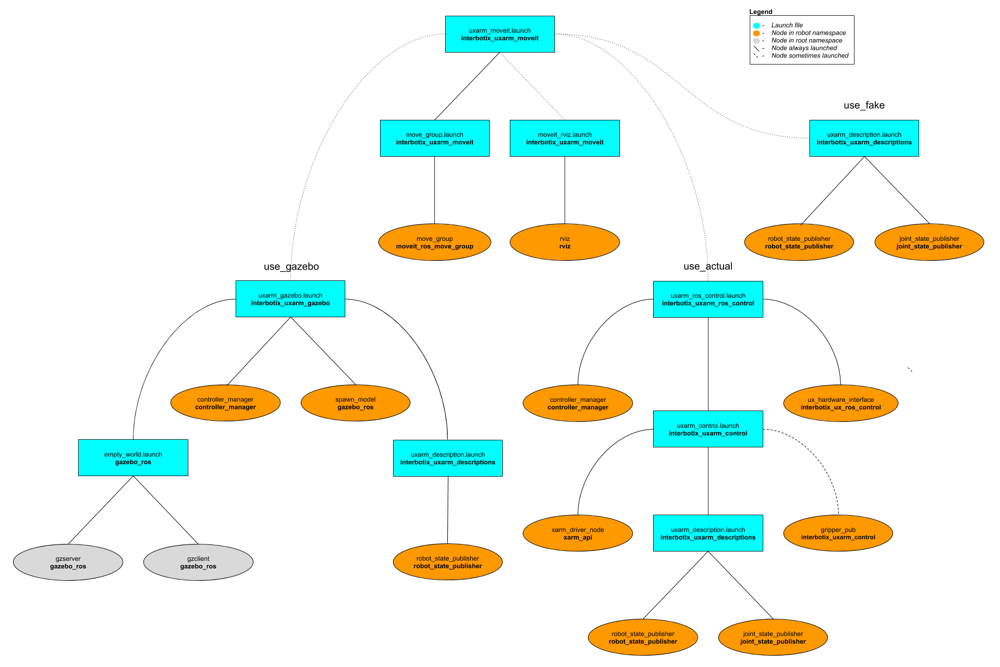

# interbotix_uxarm_moveit

## Overview
This package contains the necessary config files to get any of the UFactory xArms working with MoveIt. Originally, the MoveIt Setup Assistant wizard was used to generate a MoveIt package for each robot individually. The packages were then all merged into one and the launch files modified so that specific arguments (like `robot_model`, `dof`, and `robot_name`) could be passed down to load the right config files (such as the SRDFs). Additionally, this package makes use of the FollowJointTrajectory interface which seems to work pretty well in both Gazebo and on the physical robot. A 'master' launch file was then written to allow a user to choose whether to have MoveIt work with the simulated version, the physical robot hardware, or a MoveIt generated fake robot.

## Structure

As shown above, this package builds on top of the *interbotix_uxarm_gazebo*, *interbotix_uxarm_control*, and *interbotix_uxarm_descriptions* packages. To get familiar with those packages, please refer to their respective READMEs. Regarding the MoveIt specific nodes, they are described below:
- **move_group** - responsible for planning the trajectories needed to achieve a particular arm/gripper pose
- **rviz** - responsible for showing the robot model and including the MoveIt MotionPlanning plugin

## Usage
To run this package on the physical robot, type the line below in a terminal (assuming the xArm6 and gripper is being launched with an IP of 192.168.1.54).
```
$ roslaunch interbotix_uxarm_moveit uxarm_moveit.launch robot_model:=uxarm6 use_gripper:=true robot_ip:=192.168.1.54 use_actual:=true dof:=6
```
If running this package on a Gazebo simulated robot, type the line below in a terminal (assuming the robot above is being launched). Don't forget to unpause the Gazebo physics afterwards or MoveIt will never load!
```
$ roslaunch interbotix_uxarm_moveit uxarm_moveit.launch robot_model:=uxarm6 use_gripper:=true use_gazebo:=true dof:=6
```
If running this package on a MoveIt generated fake robot, type the line below in a terminal (assuming the robot above is being launched).
```
$ roslaunch interbotix_uxarm_moveit uxarm_moveit.launch robot_model:=uxarm6 use_gripper:=true use_fake:=true dof:=6
```
This is the bare minimum needed to get up and running. Take a look at the table below to see how to further customize with other launch file arguments.

| Argument | Description | Default Value |
| -------- | ----------- | :-----------: |
| robot_model | model type of the Interbotix Arm such as 'uxarm5' or 'uxarm6' | "" |
| robot_name | name of the robot (typically equal to `robot_model`, but could be anything) | "$(arg robot_model)" |
| base_link_frame | name of the 'root' link on the arm; typically 'base_link', but can be changed if attaching the arm to a mobile base that already has a 'base_link' frame| 'base_link' |
| use_gripper | if true, the **gripper_pub** node is launched which publishes the gripper joint state | false |
| show_gripper | if true, the gripper is included in the 'robot_description' parameter; if false, the gripper is not loaded to the parameter server. Set to false if you have a custom gripper attachment or are not using a gripper | $(arg use_gripper) |
| use_world_frame | set this to true if you would like to load a 'world' frame to the 'robot_description' parameter which is located exactly at the 'base_link' frame of the robot; if using multiple robots or if you would like to attach the 'base_link' frame of the robot to a different frame, set this to false | true |  
| external_urdf_loc | the file path to the custom urdf.xacro file that you would like to include in the Interbotix robot's urdf.xacro file| "" |
| external_srdf_loc | the file path to the custom srdf.xacro file that you would like to include in the Interbotix robot's srdf.xacro file. Note that this should only contain 'disable collision' tags for collisions between the original Interbotix Arm and other links that are defined in the file specified by `external_urdf_loc` | "" |
| use_moveit_rviz | a boolean that if true, displays Rviz with the MoveIt plugin; if false, MoveIt runs in a headless state | true |
| rviz_frame | defines the fixed frame parameter in Rviz. Note that if 'use_world_frame' is False, this parameter should be changed to a frame that exists | world |
| robot_ip | IP address of the xArm's Control Box | "" |
| gripper_pub_freq | Rate at which the gripper joint state should be published | 10 |
| gripper_pulse_vel | Speed at which gripper should move from 1 - 5000 | 1500 |
| use_gazebo | launch MoveIt with a Gazebo simulated robot | false |
| use_actual | launch MoveIt with the physical robot | false |
| use_fake | launch MoveIt with a MoveIt generated fake robot | false |
| dof | the degrees of freedom of the arm | 5 |
| world_name | the file path to the Gazebo 'world' file to load (if simulating) | refer to [uxarm_moveit.launch](launch/uxarm_moveit.launch) |

## Notes
Once the MoveIt GUI is fully loaded, take a look at the available planning groups. There should be two of them - one called 'interbotix_arm' and the other called 'interbotix_gripper'. The 'interbotix_arm' group contains the joints needed to plan the trajectories for the whole arm (excluding the gripper) while the 'interbotix_gripper' group contains the joints needed to plan the trajectories for the gripper. There are a couple saved poses for each of these groups that be executed such as 'Home' and 'Hold-Up' for the 'interbotix_arm' group, and 'Open' and 'Closed' for the 'interbotix_gripper' group. Also, it should be noted that the gripper frame of reference is located at the end of the arm - not between the gripper fingers.

Additionally, by default, the MoveIt GUI does not display the green or orange robots that represent the start and goal states for the arm respectively. To display them, navigate to the *MotionPlanning* -> *Planning Request* dropdown in Rviz and check the *Query Start State* and *Query Goal State* checkboxes.
