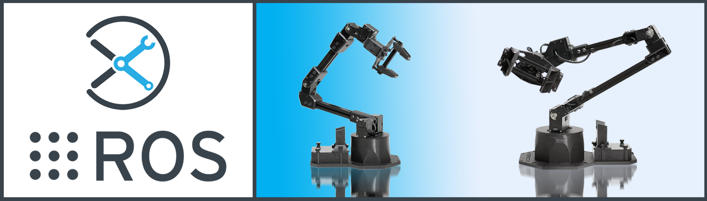

# InterbotiX X-Series Arm ROS Packages

## Overview
Welcome to the *interbotix_ros_xsarms* sub-repo! This sub-repository contains ROS packages meant to be used with the many [X-Series robotic arms](https://www.trossenrobotics.com/robotic-arms.aspx)  sold by Trossen Robotics. Packages were tested on Ubuntu Linux 16.04, 18.04, and 20.04 using ROS Kinetic, Melodic, and Noetic respectively. Additionally, all ROS nodes were written using Python or C++. However, any programming language capable of sending ROS messages can be used to control the robots. To that effect, the core packages inside this repo are as follows:
- **interbotix_xsarm_moveit** - contains the config files necessary to launch an arm using MoveIt either in Gazebo, on the physical robot, or just in Rviz
- **interbotix_xsarm_gazebo** - contains the config files necessary to launch an arm in Gazebo, including tuned PID gains for ros_control
- **interbotix_xsarm_control** - contains the motor configuration files and the 'root' launch file that is responsible for launching the robot arm
- **interbotix_xsarm_ros_control** - contains the config files necessary to setup ROS controllers between MoveIt and the physical robot arm
- **interbotix_xsarm_descriptions** - contains the meshes and URDFs (including accurate inertial models for the links) for all arm platforms

Finally, there is also an **examples** directory containing various demos of how the above mentioned core packages can be used. So what are you waiting for? Let's get started!

## IRROS Structure
Refer [here](https://github.com/Interbotix/interbotix_ros_core#code-structure) to get a general understanding of IRROS.

##### Hardware Layer
All X-Series arms are made up of [X-Series Dynamixel servos](https://www.trossenrobotics.com/dynamixel-x-series-robot-servos). Each servo has two 3-pin JST ports that allows it to be daisy chained with other servos using 3-pin cables. The 'root' Dynamixel (i.e. the 'waist' motor) then connects to the [XM/XL motor power hub](https://www.trossenrobotics.com/3-pin-x-series-power-hub.aspx). Besides for providing 12V to the motors from the barrel jack, the hub also connects to the 3-pin JST port on the [U2D2](https://www.trossenrobotics.com/dynamixel-u2d2.aspx). This device acts as a communication interface between a computer (connected via microUSB cable) and the motors - converting USB/TTL signals back and forth.

On the right side of this layer, there are two sensors. While the base robot kit from Interbotix does not come with either a RealSense camera or joystick controller, there are some demos (ROS packages in the Application layer) that may use them.

##### Driver Layer
The ROS packages in this sub-repo build up from the *interbotix_xs_sdk* ROS wrapper found in the *interbotix_ros_core* repository. Reference the package there for implementation details. The *realsense_ros* and *joy* packages are ROS wrappers around the RealSense camera and PS3/PS4 controller devices respectively.

##### Control Layer
The *interbotix_xsarm_control* ROS package found in this layer holds the config files for every one of our X-Series arms. These config files define the names of the joints that make up each arm as well as initial values for the motor registers. The launch file inside the package then passes the appropriate parameters to the *interbotix_xs_sdk* driver node depending on the type of arm being used.

##### Application Support Layer
The three main items shown in this layer can be found in the *interbotix_ros_toolboxes* repository [here](https://github.com/Interbotix/interbotix_ros_toolboxes/tree/main/interbotix_xs_toolbox). Specifically, the Arm IK Solver module can be found within the *interbotix_xs_modules* ROS package in a file called 'arm.py'. It essentially provides a small API to allow users to control an arm's end-effector in Python - no ROS experience necessary. Additionally, the *interbotix_xs_ros_control* and *interbotix_moveit_interface* packages make it possible for the *interbotix_xsarm_ros_control* and *interbotix_xsarm_moveit_interface* packages respectively to function properly.

##### Research Layer
All the ROS packages and Python scripts found within the [examples](examples/) directory fall in this category.

## Compatible Products
The ROS packages located here can be used with any of the Interbotix arm kits linked below. Next to each name is the name used to describe it in software (specifically for the `robot_model` argument in launch files). There are up to four parts in a name. In general, the first two letters represent model type (ex. 'wx' for 'WidowX'). The number afterwards corresponds to the length of both the forearm and upper-arm links in millimeters. Finally, the 's' after some numbers signifies if that arm has six degrees of freedom. The 'mobile' before some names means that arm is designed to be mounted on a mobile base.
- [PincherX 100 Robot Arm](https://www.trossenrobotics.com/pincherx-100-robot-arm.aspx) (px100)
- [PincherX 150 Robot Arm](https://www.trossenrobotics.com/pincherx-150-robot-arm.aspx) (px150)
- [ReactorX 150 Robot Arm](https://www.trossenrobotics.com/reactorx-150-robot-arm.aspx) (rx150)
- [ReactorX 200 Robot Arm](https://www.trossenrobotics.com/reactorx-200-robot-arm.aspx) (rx200)
- [WidowX 200 Robot Arm](https://www.trossenrobotics.com/widowx-200-robot-arm.aspx) (wx200)
- [WidowX 250 Robot Arm](https://www.trossenrobotics.com/widowx-250-robot-arm.aspx) (wx250)
- [WidowX 250 Robot Arm 6DOF](https://www.trossenrobotics.com/widowx-250-robot-arm-6dof.aspx) (wx250s)
- [ViperX 250 Robot Arm](https://www.trossenrobotics.com/viperx-250-robot-arm.aspx) (vx250)
- [ViperX 300 Robot Arm](https://www.trossenrobotics.com/viperx-300-robot-arm.aspx) (vx300)
- [ViperX 300 Robot Arm 6DOF](https://www.trossenrobotics.com/viperx-300-robot-arm-6dof.aspx) (vx300s)
- [PincherX 100 Mobile Robot Arm](https://www.trossenrobotics.com/pincherx-100-mobile-robot-arm.aspx) (mobile_px100)
- [WidowX 200 Mobile Robot Arm](https://www.trossenrobotics.com/widowx-200-robot-arm-mobile-base.aspx) (mobile_wx200)
- [WidowX 250 Mobile Robot Arm 6DOF](https://www.trossenrobotics.com/widowx-250-mobile-robot-arm-6dof.aspx) (mobile_wx250s)

## Requirements
Below is a list of the hardware you will need to get started:
- Computer running Ubuntu Linux 16.04, 18.04, or 20.04 (note that virtual Linux machines have NOT been tested)
- One of the X-Series Robot Arm Kits mentioned above

## Hardware Setup
There is not much required to get the robot ready to work as most of the setup is done for you. Just make sure to do the following steps:
1. Remove the robot from its packaging and place on a sturdy tabletop surface near an electrical outlet. To prevent the robot from potentially toppling during operation, secure it to a flat surface (via clamping or using the holes on the base's perimeter). At your own risk, you could instead place a small heavy bean-bag on top of the acrylic plate by the base of the robot. Finally, make sure that there are no obstacles within the workspace of the arm.
2. Plug the 12V power cable into an outlet and insert the barrel plug into the barrel jack on the X-series power hub (located under the see-through acrylic on the base of the robot). You should briefly see the LEDs on the Dynamixel motors flash red.
3. Plug in the micro-usb cable into the U2D2 (located under the see-through acrylic on the robot's base) and your computer.

## Software Setup
To get all the code setup, refer to the computer platform types below and run the appropriate installation script. Afterwards, continue with the [Installation Checks](#installation-checks) sub-section.

###### AMD64 Architecture
If your computer uses an Intel or AMD based processor (which is the case for NUCs, most laptops and desktop computers), follow the commands below to download and run the installation script. Note that the script will also install the full desktop version of ROS (either Kinetic, Melodic, or Noetic) if it's not yet on your system. As an aside, if you've been using the old ROS packages from the [interbotix_ros_arms](https://github.com/Interbotix/interbotix_ros_arms) repository, and would like to migrate to using the ROS packages in this repository, *make sure that you do not already have a catkin workspace named 'interbotix_ws'*. Otherwise, the install script will not clone these packages. Either rename or delete the old 'interbotix_ws' workspace beforehand.

    $ sudo apt install curl
    $ curl 'https://raw.githubusercontent.com/Interbotix/interbotix_ros_manipulators/main/interbotix_ros_xsarms/install/amd64/xsarm_amd64_install.sh' > xsarm_amd64_install.sh
    $ chmod +x xsarm_amd64_install.sh
    $ ./xsarm_amd64_install.sh

###### Raspberry Pi 4B (ARM64 Architecture)
If you purchased a Raspberry Pi 4B Kit with an arm from our website, there is no need to install anything as the Pi should already come preloaded with all the necessary software. If you purchased your own Raspberry Pi 4B from a third party, feel free to follow the instructions [here](https://github.com/Interbotix/interbotix_ros_toolboxes/blob/main/interbotix_rpi_toolbox/README.md) to get it properly setup before following the commands below. If you only purchased the stand-alone Raspberry Pi 4B Kit from our store (which comes pre-configured with Ubuntu and ROS), and would like to use it with an arm, then follow the commands below to download and run the installation script. Note that the script will install the full desktop version of ROS if it's not yet on your system, ask you for your desired robot model (ex. wx200), and prompt you about whether or not you'd like the Joystick ROS package to start at boot.

    $ sudo apt install curl
    $ curl 'https://raw.githubusercontent.com/Interbotix/interbotix_ros_manipulators/main/interbotix_ros_xsarms/install/rpi4/xsarm_rpi4_install.sh' > xsarm_rpi4_install.sh
    $ chmod +x xsarm_rpi4_install.sh
    $ ./xsarm_rpi4_install.sh

If you *do* want to have the Joystick ROS package start at boot, you will first have to pair your PS4 controller with the Pi. Refer [here](https://github.com/Interbotix/interbotix_ros_toolboxes/tree/main/interbotix_rpi_toolbox#ps4-controller-setup) for details.

##### Remote Install
For some robotic projects, you may want to run your robot in a 'headless' state on some computer (like a NUC or Raspberry Pi), and monitor the robot's state (in Rviz for example) on your personal (a.k.a remote) computer over a local network. For this to work, run the installation script below on your personal Linux computer. Note that ROS and Rviz must already be installed! As an FYI, the script will prompt you to insert the hostname of the robot (NOT the remote) computer. As an example, if you wanted to monitor the state of a robot arm purchased with a Raspberry Pi 4B Kit, you would set the hostname to `pibot`. To find out the hostname of the robot computer, just open a terminal and type `hostname`

    $ sudo apt install curl
    $ curl 'https://raw.githubusercontent.com/Interbotix/interbotix_ros_manipulators/main/interbotix_ros_xsarms/install/xsarm_remote_install.sh' > xsarm_remote_install.sh
    $ chmod +x xsarm_remote_install.sh
    $ ./xsarm_remote_install.sh

Be aware that the installation script will export the ROS_MASTER_URI environment variable in your personal computer's ~/.bashrc file to `http://<hostname>.local:11311`. Make sure to comment out this line when done monitoring or your personal computer will complain about not being able to find its ROS Master.

##### Installation Checks
After running the installation script on the robot computer, verify that it was successful in finding the U2D2 by checking that the port name shows up as `ttyDXL`

    $ cd /dev
    $ ls
    $ cd

For ROS Melodic users, open the following Gazebo config file to fix an issue described [here](https://answers.gazebosim.org//question/25030/gazebo-error-restcc205-error-in-rest-request/).

    $ nano ~/.ignition/fuel/config.yaml

Now change the url inside from `https://api.ignitionfuel.org` to `https://api.ignitionrobotics.org`.

## Quickstart

1. Get familiar with the virtual robot model by launching it in Rviz and playing with the *joint_state_publisher*. Note that you must specify which arm model is being used as a command line argument. For example, the WidowX 200 robot arm can be launched as follows:

        $ roslaunch interbotix_xsarm_descriptions xsarm_description.launch robot_model:=wx200 use_joint_pub_gui:=true

2. Get familiar with the physical robot arm (let's say... a ViperX 250!) by executing the following command in the terminal (Ctrl-C from Step 1 first):

        $ roslaunch interbotix_xsarm_control xsarm_control.launch robot_model:=vx250

3. By default, all the motors in the robot are torqued on so it will be very difficult to manually manipulate it. To torque off all the motors, execute the command below in another terminal. Be aware though that this will cause the robot to collapse so manually hold or secure the arm before executing it.

        $ rosservice call /vx250/torque_enable "{cmd_type: 'group', name: 'all', enable: false}"

4. Now you should be able to freely manipulate the arm and gripper. Take note of how the Rviz model accurately mimics the real robot. To make the robot hold a certain pose, manually hold the robot in the desired pose and execute the following command:

        $ rosservice call /vx250/torque_enable "{cmd_type: 'group', name: 'all', enable: true}"

    You can now let go and observe how the arm stays in place.

That ends the quickstart tutorial. To get familiar with the architecture and launch file arguments, refer to the READMEs of the core packages. Start with the [interbotix_xsarm_descriptions](interbotix_xsarm_descriptions/) package, then the [interbotix_xsarm_control](interbotix_xsarm_control/) package. Next, look at the [interbotix_xsarm_gazebo](interbotix_xsarm_gazebo/) package followed by the [interbotix_xsarm_ros_control](interbotix_xsarm_ros_control/) and [interbotix_xsarm_moveit](interbotix_xsarm_moveit/) packages. This is the most logical approach to take to gain a better understanding of how they relate to each other. Afterwards, feel free to check out the demo projects in the [examples](examples/) directory.

## Troubleshooting
Refer to the guide [here](https://github.com/Interbotix/interbotix_ros_core/blob/main/interbotix_ros_xseries/interbotix_xs_sdk/TROUBLESHOOTING.md#troubleshooting-a-dynamixel-based-robot) to try to solve your problem. If you still need help, feel free to contact us as trsupport@trossenrobotics.com or submit an Issue. We strongly recommend the latter option though so that other people who may be facing the same difficulty can benefit. This repository is actively maintained and any open Issues will be addressed as soon as possible.

## Contributing
To contribute your own custom X-Series arm in this repo, you will need to do the following steps:
- Create a motor config file similar to the YAML files found [here](interbotix_xsarm_control/config/) (excluding the 'modes.yaml' file). To get familiar with the parameter names, checkout the [Motor Config Template](https://github.com/Interbotix/interbotix_ros_core/blob/main/interbotix_ros_xseries/interbotix_xs_sdk/config/motor_configs_template.yaml). Note that the name of this file is what defines your *robot_model* name, and should be used when naming other files like the URDF.
- Create a URDF similar in structure to the ones found [here](interbotix_xsarm_descriptions/urdf/). Don't forget to put all necessary meshes in the [meshes](interbotix_xsarm_descriptions/meshes/) directory! As an FYI, you should follow the naming convention for the links, joints, and frame poses as found in the other arm files for consistency.
- Create a set of Gazeo/ROS position controllers similar to the ones found [here](interbotix_xsarm_gazebo/config/position_controllers/).
- Create a set of Gazeo/ROS trajectory controllers similar to the ones found [here](interbotix_xsarm_gazebo/config/trajectory_controllers/).
- Create an SRDF file for Moveit similar to the ones found [here](interbotix_xsarm_moveit/config/srdf/). You should first use the MoveIt Setup Assistant Wizard for this step and then edit the generated SRDF file based on the structure of those files.
- Add the appropriate Screw axes and M matrices to the [mr_descriptions](https://github.com/Interbotix/interbotix_ros_toolboxes/blob/main/interbotix_xs_toolbox/interbotix_xs_modules/src/interbotix_xs_modules/mr_descriptions.py) module. For help doing this, refer to Chapter 4 in [Modern Robotics](http://hades.mech.northwestern.edu/images/7/7f/MR.pdf) and [this video](https://www.youtube.com/watch?v=cKHsil0V6Qk&ab_channel=NorthwesternRobotics).
- Make sure to follow the same naming convention, structure, and documentation procedures as found in the repo before making a PR.

## Contributors
- [Solomon Wiznitzer](https://github.com/swiz23) - **ROS Engineer**
- [Levi Todes](https://github.com/LeTo37) - **CAD Engineer**
