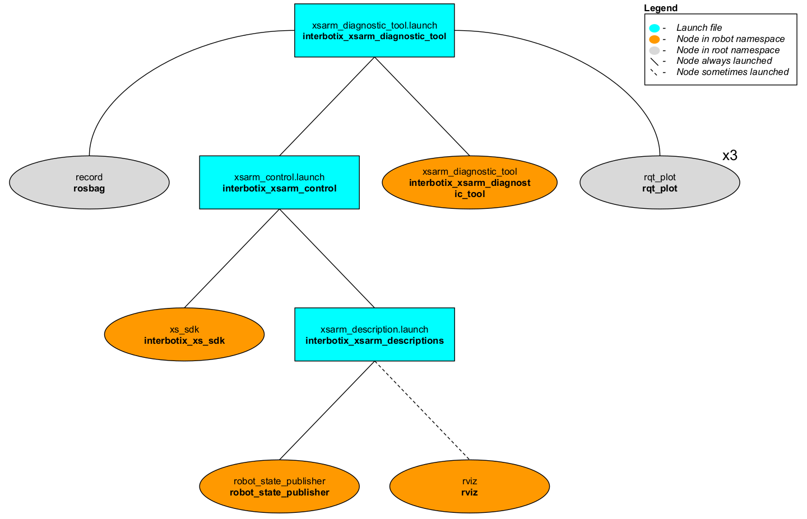

# interbotix_xsarm_diagnostic_tool

## Overview
This package is meant to be used as a way to analyze joint data over time. For example, if the user would like the arm to perform a certain task but is not sure if it will 'strain' a specific arm joint too much, then this tool would be an easy way to record, save (to a rosbag and CSV file), and view data live while the joint in question rotates.

## Structure

As shown above, the *interbotix_xsarm_diagnostic_tool* package builds on top of the *interbotix_xsarm_control* package. To get pointers about the nodes in the that package, please look at its README. The other nodes are described below:
- **xsarm_diagnostic_tool** - responsible for commanding joint positions to the user-specified joint following a sinusoidal trajectory; the trajectory is symmetric around '0' radians where the upper bound is the minimum of the absolute value of the upper and lower joint limits. It also publishes temperatures at all the arm joints (excluding gripper) to the `/<robot_name>/temperatures/joint_group` topic
- **record** - responsible for recording the `/<robot_name>/commands/joint_single`, `/<robot_name>/joint_states`, and `/<robot_name>/temperatures/joint_group` topics and saving it to a user-specified bagfile
- **rqt_plot** - three instances of this node are launched to plot data for a user-specified joint; one plots the joint commands along with the observed joint positions [rad] and velocities [rad/s] vs. time [s]. Another plots effort [mA] vs time [s], while the last one plots joint temperature [C] vs. time [s].

## Usage
To use this package, first manually manipulate the arm (let's say the PincherX 150) until the desired starting pose is reached. Then type the command below (if testing the waist joint):
```
$ roslaunch interbotix_xsarm_diagnostic_tool xsarm_diagnostic_tool.launch arm_model:=px150 cmd_joint:=waist observe_joint:=waist bag_name:=px150_diagnostics
```
Keep holding the arm until the motors torque on. At this point, let go of the arm. Since the `cmd_joint` argument is `waist`, this means that the 'waist' joint will begin to rotate following a sinusoidal trajectory. Additionally, since the `observe_joint` argument is `waist`, the plots will start showing data for the 'waist' joint only. The plot axes might have to be adjusted to visualize the data properly. The joint will then continue to rotate for the user-specified time (see the launch file argument table below) at which point the arm will go to its 'sleep' pose and the **xsarm_diagnostic_tool** node will terminate. Finally, the user should 'Cntrl-C' the launch file so that *rosbag* will stop recording data.

To convert the *rosbag* data to a csv file, navigate to the [scripts](scripts/) directory. If the 'bag2csv.py' program is not yet executable, make it so by typing:
```
chmod a+x bag2csv.py
```

Next, type:
```
$ python bag2csv.py px150 waist px150_diagnostics.bag px150_diagnostics.csv
```
The command is pretty self explanatory - the arguments are the robot name, the name of the joint to be observed, the bagfile name (the program expects it to be located in the 'bag' directory), and the desired CSV file name. To better understand how this program works, take a look at [bag2csv.py](scripts/bag2csv.py). Then, take a look at the table below to understand the launch file arguments.

| Argument | Description | Default Value |
| -------- | ----------- | :-----------: |
| robot_model | model type of the Interbotix Arm such as 'wx200' or 'rx150' | "" |
| robot_name | name of the robot (typically equal to `robot_model`, but could be anything) | "$(arg robot_model)" |
| base_link_frame | name of the 'root' link on the arm; typically 'base_link', but can be changed if attaching the arm to a mobile base that already has a 'base_link' frame| 'base_link' |
| use_rviz | launches Rviz | true |
| mode_configs | the file path to the 'mode config' YAML file | refer to [xsarm_diagnostic_tool.launch](launch/xsarm_diagnostic_tool.launch) |
| cmd_joint | name of the joint to rotate | waist |
| observe_joint | name of the joint for which to plot data (doesn't have to be the same as `cmd_joint`) | waist |
| test_duration | duration of test in seconds | 600 |
| bag_name | name of the *rosbag* for which to save data | "$(arg observe_joint)_diagnostics" |
| use_rqt | whether or not the rqt plots (with preloaded topics) should be launched; note that this should always be set to false in Kinetic due to a [bug](https://answers.ros.org/question/347215/cant-run-graph-with-command-rosrun-rqt_plot-rqt_plot/) in rqt. To visualize data in Kinetic, just manually open rqt and create the plots as outlined in the launch file | true |
| launch_driver | true if the *xsarm_control.launch* file should be launched - set to false if you would like to run your own version of this file separately | true |

## Notes

If choosing to rotate the 'waist' joint, make sure during the  initial step of manually positioning the arm that it is NOT rotated past the joint limit (+/-180 degrees). Otherwise, the cable connecting the 'waist' motor to the 'shoulder' motor(s) can be ripped out.

Also, take a note of the [data](data/) directory in the package. After plotting and saving the data to a CSV, it might be a good idea to create a new directory to keep all the files together. In this case, the CSV file and picture in that directory show diagnostics for the waist joint of the WidowX 200 arm as it rotates for 100 seconds.
