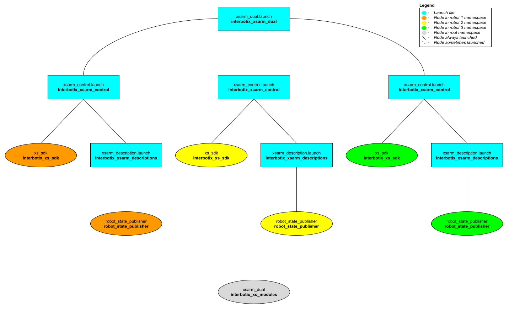

# interbotix_xsarm_dual

## Overview
This package shows how to get two X-Series arms working together. While the example here is specifically geared for two WidowX 200 arms, there is no limit to the number of arms that can be used (except USB ports on your computer). Also, any of the X-Series arms can be used together - not just WidowX 200 arms. For the purpose of the demo, the [Interbotix Python Arm Module](https://github.com/Interbotix/interbotix_ros_toolboxes/blob/main/interbotix_xs_toolbox/interbotix_xs_modules/src/interbotix_xs_modules/arm.py) is used, so you should familiarize yourself with the functions there and also look at the README in the [python_demos](../python_demos) directory.

## Structure

As shown above, the *interbotix_xsarm_dual* package builds on top of the *interbotix_xsarm_control* package. The number of instances that the *interbotix_xsarm_control* package is included in the 'xsarm_dual' launch file is equivalent to the number of robots being used. See the other packages for descriptions of their nodes.

## Usage
To get started, make sure that the U2D2s for both robots are not connected to your computer. Then connect the U2D2 that you'd like to be `robot_1` (as defined in the [demo python script](scripts/xsarm_dual.py)). Afterwards, connect the robot you'd like to be `robot_2`. The reason for this is that Linux assigns USB port names starting at 0 and going up. So the first U2D2 plugged in will be called `/dev/ttyUSB0` while the second U2D2 plugged in will be called `/dev/ttyUSB1`. If you're familiar with udev rules, you can create a unique symlink for each U2D2 by finding its serial id with the following command (make sure you do this with only one U2D2 plugged in at a time)

```
udevadm info -a -n /dev/ttyUSB0 | grep {serial}
```
The output should look similar to the below but with a different ID...

```
ATTRS{serial}=="FT4NQ5QO"
```

Then go to `/etc/udev/rules.d` and edit the `99-interbotix-udev.rules` file by adding the line below for each of your U2D2s. Note that I've used the serial ID above and gave a custom symlink of `ttyRBT1` arbitrarily.

```
SUBSYSTEM=="tty", ATTRS{idVendor}=="0403", ATTRS{idProduct}=="6014", ATTRS{serial}=="FT4NQ5QO", ENV{ID_MM_DEVICE_IGNORE}="1", ATTR{device/latency_timer}="1", SYMLINK+="ttyRBT1"
```

Now make sure to update the `port` name in the 'modes.yaml' files in the [config](config/) directory to point to your new symlinks. Then unplug/replug the U2D2s to refresh the ports and run the launch file below.

```
roslaunch interbotix_xsarm_dual xsarm_dual.launch
```

Then navigate to the [scripts](scripts/) directory and type `python xsarm_dual.py`.

To further customize the launch file at run-time (like with a different robot model), look at the table below:

| Argument | Description | Default Value |
| -------- | ----------- | :-----------: |
| robot_model_1 | model type of the first Interbotix Arm such as 'wx200' or 'rx150' | "" |
| robot_name_1 | arbitrary name that is unique to the first robot arm | "arm_1" |
| base_link_1 | name of the 'root' link on the arm; typically 'base_link', but can be changed if attaching the arm to a mobile base that already has a 'base_link' frame| 'base_link' |
| modes_1 | the file path to the 'mode config' YAML file for the first robot | refer to [xsarm_dual.launch](launch/xsarm_dual.launch) |
| robot_model_2 | model type of the second Interbotix Arm such as 'wx200' or 'rx150' | "" |
| robot_name_2 | arbitrary name that is unique to the second robot arm | "arm_2" |
| base_link_2 | name of the 'root' link on the arm; typically 'base_link', but can be changed if attaching the arm to a mobile base that already has a 'base_link' frame| 'base_link' |
| modes_2 | the file path to the 'mode config' YAML file for the second robot | refer to [xsarm_dual.launch](launch/xsarm_dual.launch) |
| use_sim | if true, the Dynamixel simulator node is run; use Rviz to visualize the robot's motion; if false, the real Dynamixel driver node is run | false |
| use_dual_rviz | launches Rviz to show both arms | false |
| rvizconfig | file path to the config file Rviz should load | refer to [xsarm_dual.launch](launch/xsarm_dual.launch) |
