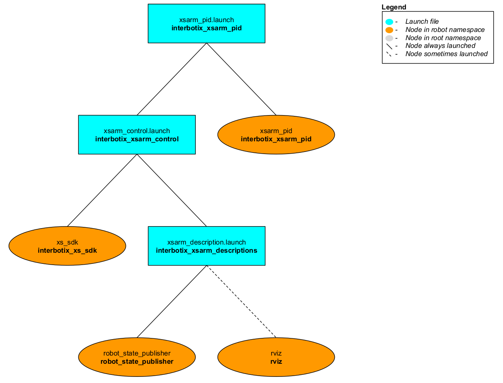

# interbotix_xsarm_pid

## Overview
This package can be used as a way to test 'pwm' or 'current' PID gains when operating the arm in either 'pwm' or 'current' mode. PID gains are read into the controller node from the [gains.yaml](config/gains.yaml) file. The node then commands the arm to its 'home' pose and waits ten seconds for it to settle. Then it commands the arm to its 'sleep' pose and waits another ten seconds for it to settle. Finally, the node commands all the motors to either zero pwm or zero current (effectively torquing them off) before shutting itself down.

## Structure

As shown above, the *interbotix_xsarm_pid* package builds on top of the *interbotix_xsarm_control* package. To get pointers about the nodes in the that package, please look at its README. The node specific to this package is described below.
- **xsarm_pid** - contains a simple PID controller to command the arm joints (excluding gripper) first to their 'home' positions and then to their 'sleep' positions; it receives the desired PID gains from [gains.yaml](config/gains.yaml) and the `control_mode` as a parameter.

## Usage
To run this package, first create a 'gains.yaml' file similar to the one [here](config/gains.yaml) with your desired 'pwm' or 'current' PID gains. Then run the command below (assuming the ReactorX 150 is being used in 'pwm' mode).
```
roslaunch interbotix_xsarm_pid xsarm_pid.launch robot_model:=rx150 control_mode:=pwm
```
To further customize the launch of the robot, take a look at the table below.

| Argument | Description | Default Value |
| -------- | ----------- | :-----------: |
| robot_model | model type of the Interbotix Arm such as 'wx200' or 'rx150' | "" |
| robot_name | name of the robot (typically equal to `robot_model`, but could be anything) | "$(arg robot_model)" |
| base_link_frame | name of the 'root' link on the arm; typically 'base_link', but can be changed if attaching the arm to a mobile base that already has a 'base_link' frame| 'base_link' |
| use_rviz | launches Rviz | true |
| mode_configs | the file path to the 'mode config' YAML file | refer to [xsarm_pid.launch](launch/xsarm_pid.launch) |
| control_mode | the outputted command from the control loop - can be either 'pwm' or 'current' | pwm |
| gains_filepath | the file path to the 'gains' YAML file | refer to [xsarm_pid.launch](launch/xsarm_pid.launch) |
| launch_driver | true if the *xsarm_control.launch* file should be launched - set to false if you would like to run your own version of this file separately | true |
