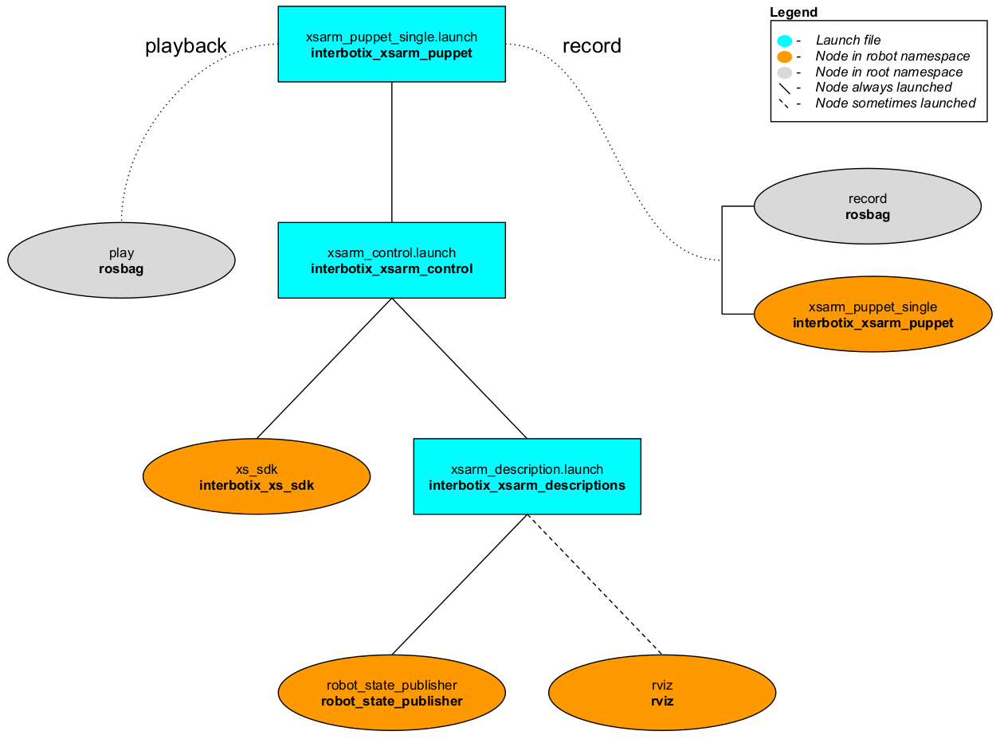
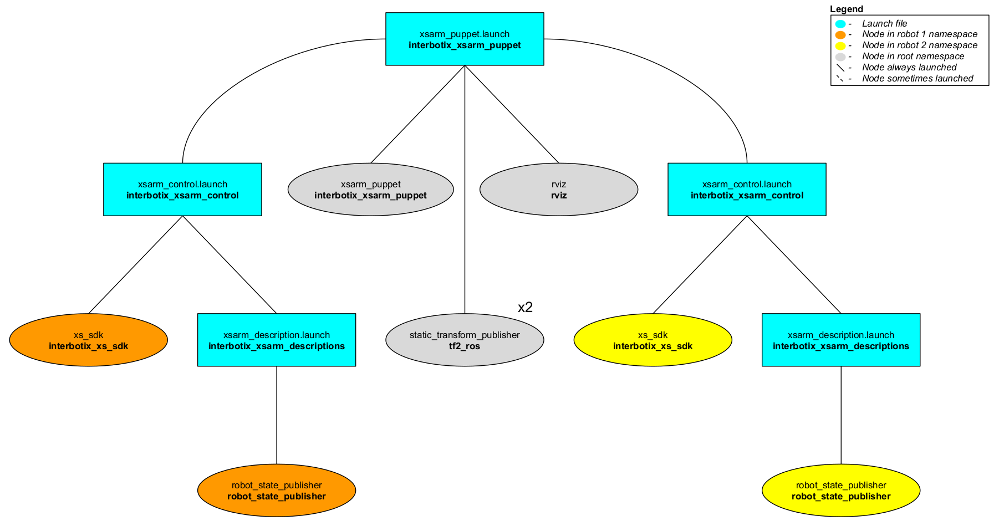

# interbotix_xsarm_puppet

## Overview
This package demos two similar features that the Interbotix arms support. Imagine that you would like to have the robot arm perform some motions to achieve a specific task. One way of doing this would be to create a [JointTrajectory](http://docs.ros.org/melodic/api/trajectory_msgs/html/msg/JointTrajectory.html) of desired joint positions at specific times which you could then command the robot. Alternatively (and much less time consuming), you could manually manipulate the arm to do the specific motions and record them in a ROS bag file. Then, you could 'play back' the bag file as many times as you like to repeat the motions on the same robot later. This 'record/playback' feature is made possible by the **xsarm_puppet_single**.

Now imagine that you have two (or more) Interbotix arms with the same number of joints. What the **xsarm_puppet** allows you to do is to manually manipulate one of the arms and watch as the motion is repeated in real time on the second robot. A potential application of this could be a warehousing environment. Instead of a worker straining his back to lift a heavy package, he could manually manipulate a small version of a robotic arm to maneuver an industrial-sized arm to pick it up.
## Structure
As shown below, the *interbotix_xsarm_puppet* package builds on top of the *interbotix_xsarm_control* package. To get familiar with that package, please look at its README. The nodes specific to this package are described below.



The above diagram shows the structure for the 'record/playback' feature. The two nodes involved are:
- **xsarm_puppet_single** - responsible for reading the arm's current joint states and publishing them as position commands to the `/<robot_name>/commands/joint_group` and `/<robot_name>/commands/joint_single` topics. Conveniently, as the arm is torqued off so that the user can manipulate it, the joints will not act upon these commands
- **record** - responsible for recording the two topics mentioned above in a bagfile so that they can be played back later
- **play** - responsible for playing back the bagfile mentioned above with the arm in a torqued on state; the playback is delayed 3 seconds to give time for the **xs_sdk** node to load



The above diagram shows the structure for the 'puppet control' feature. The nodes involved are:
- **xsarm_puppet** - responsible for reading the current joint states from one arm and then publishing them as position commands to a second arm; it accepts two robot names as parameters - `robot_name_master` and `robot_name_puppet`
- **static_transform_publisher** - two of these nodes are launched to specify the position of both arms relative to the Rviz 'world' frame
- **rviz** - only launch one instance of Rviz with two RobotModels for the two robot arms

## Usage
### Record/Playback
To record joint commands while manipulating a single robot (let's say the PincherX 150), type the following in a terminal:
```
roslaunch interbotix_xsarm_puppet xsarm_puppet_single.launch robot_model:=px150 record:=true
```
Once the nodes finish launching, manually manipulate the arm and gripper through your desired motions. When done, return the robot to its initial starting position and 'Cntrl-C' the nodes so that *rosbag* stops recording. By default, the bag-file will be saved in the [bag](bag/) directory. To playback the motion, type the following in the terminal:
```
roslaunch interbotix_xsarm_puppet xsarm_puppet_single.launch robot_model:=px150 playback:=true
```
If you specified a custom bagfile name, make sure to include the name in the above command as well. When the bagfile finishes playing, you can restart it by navigating to the directory where the bag-file is located and in a terminal, type:
```
rosbag play <bagfile name>
```
The robot should now repeat the motions. When done, 'Cntrl-C' to stop all nodes. To see other command line arguments for the 'xsarm_puppet_single.launch' file, refer to the table below.

| Argument | Description | Default Value |
| -------- | ----------- | :-----------: |
| robot_model | model type of the Interbotix Arm such as 'wx200' or 'rx150' | "" |
| robot_name | name of the robot (typically equal to `robot_model`, but could be anything) | "$(arg robot_model)" |
| base_link_frame | name of the 'root' link on the arm; typically 'base_link', but can be changed if attaching the arm to a mobile base that already has a 'base_link' frame| 'base_link' |
| use_rviz | launches Rviz | true |
| record | record joint commands while physically manipulating the arm to a bagfile | false |
| playback | play-back joint commands from a bagfile to a torqued on arm | false |
| bag_name | Desired ROS bag file name | $(arg robot_name)_commands |
| launch_driver | true if the *xsarm_control.launch* file should be launched - set to false if you would like to run your own version of this file separately | true |
| use_sim | if true, the Dynamixel simulator node is run; use Rviz to visualize the robot's motion; if false, the real Dynamixel driver node is run | false |

### Puppet Control
To run this feature, plug two robots with the same number of joints (ex. the PincherX 150 and WidowX 250) into two USB ports and in a terminal, type:
```
roslaunch interbotix_xsarm_puppet xsarm_puppet.launch robot_model_master:=px150 robot_model_puppet:=wx250
```
It might be good idea to verify which robot is given `ttyUSB0` as its port name so that you know which robot should be manually manipulated. Do this by only plugging one robot into your computer and looking at the name in the `/dev` directory before plugging in the second one. Next, manually manipulate the first arm and observe how the second arm closely mimics the motion! To see other command line arguments for the 'xsarm_puppet.launch' file, refer to the table below.

| Argument | Description | Default Value |
| -------- | ----------- | :-----------: |
| robot_model_master | model type of the master Interbotix Arm (the one being physically manipulated) | "" |
| robot_model_puppet | model type of the puppet Interbotix Arm (the one that is torqued on and that responds to commands) | "" |
| base_link_master | name of the 'root' link on the 'master' arm; typically 'base_link', but can be changed if attaching the arm to a mobile base that already has a 'base_link' frame| 'base_link' |
| base_link_puppet | name of the 'root' link on the 'puppet' arm; typically 'base_link', but can be changed if attaching the arm to a mobile base that already has a 'base_link' frame| 'base_link' |
| master_modes | the file path to the master 'mode config' YAML file | refer to [xsarm_puppet.launch](launch/xsarm_puppet.launch) |
| puppet_modes | the file path to the puppet 'mode config' YAML file | refer to [xsarm_puppet.launch](launch/xsarm_puppet.launch) |
| use_puppet_rviz | launches Rviz to show both arms | true |
| rvizconfig | file path to the config file Rviz should load | refer to [xsarm_puppet.launch](launch/xsarm_puppet.launch) |
| launch_driver | true if the *xsarm_control.launch* file should be launched - set to false if you would like to run your own version of this file separately | true |
| use_sim | if true, the Dynamixel simulator node is run; use Rviz to visualize the robot's motion; if false, the real Dynamixel driver node is run | false |

## Notes
There is a bag file in the [bag](bag/) directory. It was created using the 'record/playback' feature with the WidowX 250 arm. See if you can figure out what it does! As a hint, it involves rubber ducks. To run it in simulation, type...
```
roslaunch interbotix_xsarm_puppet xsarm_puppet_single.launch robot_model:=wx250 use_sim:=true playback:=true bag_name:=duck_dunk
```
