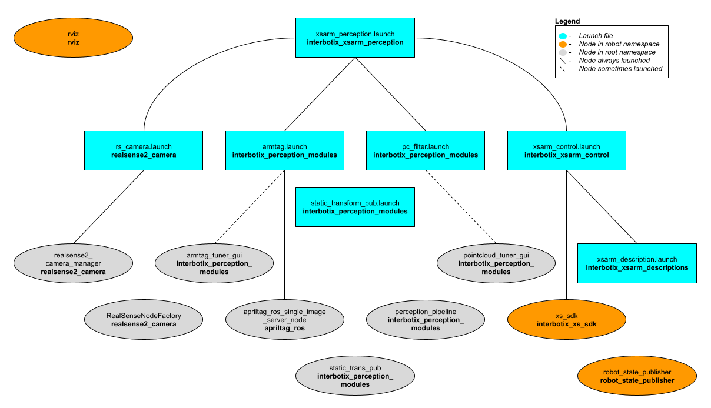
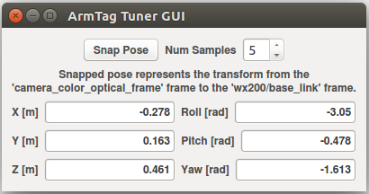
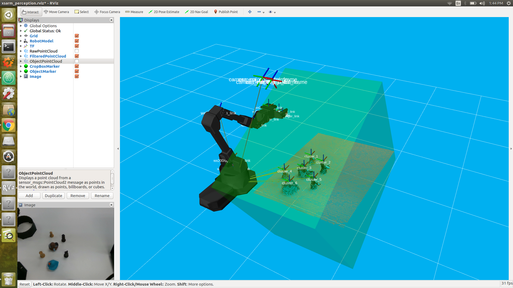

# interbotix_xsarm_perception

## Overview
This package contains the necessary config and launch files to get any of the many Interbotix X-Series arms working with the [perception pipeline](https://industrial-training-master.readthedocs.io/en/melodic/_source/session5/Building-a-Perception-Pipeline.html). The end result allows for an arm to pick up any small, non-reflective object from a tabletop-type surface that is within a RealSense color/depth camera's field of view. While any Intel RealSense color/depth camera can be used, this package was mainly tested with the [SR305](https://www.intelrealsense.com/depth-camera-sr305/) and [D415](https://www.intelrealsense.com/depth-camera-d415/) cameras. See more details on how the pipeline works in the [interbotix_perception_modules](https://github.com/Interbotix/interbotix_ros_toolboxes/tree/main/interbotix_perception_toolbox/interbotix_perception_modules) ROS package. To purchase our vision kit (which includes a D415 camera and stand), visit our website.

## Structure

As shown above, this package builds on top of the *interbotix_xsarm_control* and *interbotix_perception_modules* packages. To get familiar with those packages, please refer to their respective READMEs. The other nodes are described below:
- **realsense2_camera_manager** - nodelet manager to manage the camera nodelet below
- **RealSenseNodeFactory** - nodelet to create a ROS interface for the RealSense camera

## Usage
To work with this package, first build your stand and secure the RealSense camera on the 1/4 inch screw at the top. Then place the stand in your work area and adjust the goose-neck or ball/socket joint such that the camera is pointed towards your tabletop. Next, place some small, non-reflective objects on the tabletop such that they are clearly visible to the camera and are reachable by the arm. The objects should be small enough such that they can easily fit between the gripper fingers on the robot arm no matter the gripper's orientation. They can not be too reflective though as that will interfere with the depth camera's ability to locate them (as it uses infrared light). Similarly, the workspace should not be in direct sunlight as that also interferes with the camera's depth sensing abilities. Otherwise, the arm, camera, and small objects can be arbitrarily placed. For the demo [here](scripts/pick_place.py), you should setup your workspace area as shown below.


Before the arm picks up any object, two things must be done. First, the camera must know where the arm is relative to itself. One way of doing this is by manually measuring the offset from the camera's color optical frame to the robot's base_link frame and publishing it as a static transform. However, this is time consuming and prone to error. Instead, the [apriltag_ros](https://github.com/AprilRobotics/apriltag_ros) ROS package is used to find the transform of the AprilTag on the arm's end-effector (looks like a smiley face :P) relative to the camera's color optical frame. Following this, the transform from the camera's color optical frame to the arm's base_link frame is calculated and published as a static transform.

To get that transform, run the following launch command in a terminal (assuming a WidowX 200 arm is being used)...

```
roslaunch interbotix_xsarm_perception xsarm_perception.launch robot_model:=wx200 use_pointcloud_tuner_gui:=true use_armtag_tuner_gui:=true
```

Rviz should pop up along with two standalone GUIs. One of those GUIs will look like the picture below.

<p align="center">
  
</p>

Depending on how you setup your arm and camera in your workspace, the AprilTag on the arm may not be visible to the camera. To make it visible, first torque off all the arm joints by opening a terminal and typing...

```
rosservice call /wx200/torque_enable "{cmd_type: 'group', name: 'arm', enable: false}"
```

Next, manually manipulate the arm such that the AprilTag is clearly visible to the camera (the live video stream in the bottom left of the Rviz display should help with that). Then in the same terminal as before, torque the arm back on as follows...

```
rosservice call /wx200/torque_enable "{cmd_type: 'group', name: 'arm', enable: true}"
```

Now, in the Armtag Tuner GUI, click the 'Snap Pose' button. Feel free to toggle up/down the number of snapshots that should be taken. The poses calculated from the snapshots will then be averaged to come up with a more accurate pose of where the arm is relative to the camera. One way to check the accuracy of the calculated pose is to toggle the `RawPointCloud` display in Rviz. Hopefully, the pointcloud version of the AprilTag should be located on (possibly a couple millimeters below) the AR tag link of the virtual robot model. If it's not, feel free to keep pressing the 'Snap Pose' button until it looks alright.

At this point, you should see a pointcloud version of your tabletop with the objects on it. If your arm is in the way, just torque it off and move it to its Sleep pose (make sure to hold the arm before torquing it off). Then, using the PointCloud Tuner GUI, tune the pointcloud parameters for your specific use case. A detailed explanation of how to go about doing this can be found [here](https://github.com/Interbotix/interbotix_ros_toolboxes/tree/main/interbotix_perception_toolbox/interbotix_perception_modules). Don't forget to save your configs after tuning them!

Now you should be able to successfully run the [pick_place.py](scripts/pick_place.py) script. First make sure to edit the robot name in the script to your robot model (if it's not the WidowX 200 arm). You can also comment out lines 18 and 25 - 28 that deal with getting the pose of the arm relative to the camera. As you've already done this above, there's no need to do it again. However, the code is there just in case you'd rather snap the AR tag pose in a script rather than with the GUI.

While running the script, you should see a TF marker appear close to the top of each object's cluster (see the image below for clarification). This is where the camera believes the top of each cluster to be, and is the position returned to the user from the `get_cluster_positions` function. These TFs are temporary and will fade from Rviz after a minute is up. The arm will then line up its `ee_gripper_link` to be in the same spot as each of these cluster positions and hopefully pick up the objects.



After running the demo, `Ctrl-C` from the launch file. The 'camera to arm base_link' transform will automatically be saved in a file called 'static_transforms.yaml' in the [config](config/) directory. Now, you can run the demo script headless - first by typing...

```
roslaunch interbotix_xsarm_perception xsarm_perception.launch robot_model:=wx200 use_rviz:=false
```

...then heading over to the [scripts](scripts/) directory and running the [pick_place.py](scripts/pick_place.py) script.

For more info, check out the [Armtag](https://github.com/Interbotix/interbotix_ros_toolboxes/tree/main/interbotix_perception_toolbox/interbotix_perception_modules/src/interbotix_perception_modules/armtag.py) or [Pointcloud](https://github.com/Interbotix/interbotix_ros_toolboxes/tree/main/interbotix_perception_toolbox/interbotix_perception_modules/src/interbotix_perception_modules/pointcloud.py) Python APIs to reference the fully documented functions.

Other launch file arguments for further customization can be seen below...

| Argument | Description | Default Value |
| -------- | ----------- | :-----------: |
| robot_model | model type of the Interbotix Arm such as 'wx200' or 'rx150' | "" |
| robot_name | name of the robot (typically equal to `robot_model`, but could be anything) | "$(arg robot_model)" |
| base_link_frame | name of the 'root' link on the arm; typically 'base_link', but can be changed if attaching the arm to a mobile base that already has a 'base_link' frame| 'base_link' |
| show_gripper_bar | if true, the gripper_bar link is included in the 'robot_description' parameter; if false, the gripper_bar and finger links are not loaded to the parameter server. Set to false if you have a custom gripper attachment | true |
| show_gripper_fingers | if true, the gripper fingers are included in the 'robot_description' parameter; if false, the gripper finger links are not loaded to the parameter server. Set to false if you have custom gripper fingers | true |
| external_urdf_loc | the file path to the custom urdf.xacro file that you would like to include in the Interbotix robot's urdf.xacro file| "" |
| use_rviz | launches Rviz | true |
| load_configs | a boolean that specifies whether or not the initial register values (under the 'motors' heading) in a Motor Config file should be written to the motors; as the values being written are stored in each motor's EEPROM (which means the values are retained even after a power cycle), this can be set to false after the first time using the robot. Setting to false also shortens the node startup time by a few seconds and preserves the life of the EEPROM | true |
| filters | types of RealSense camera filters to use (in this case, the 'pointcloud' filter is needed) | pointcloud |
| color_fps | frame rate of the color images taken on the RealSense camera| 30 |
| depth_fps | frame rate of the depth images taken on the RealSense camera| 30 |
| color_width | horizontal resolution of the color images taken on the RealSense camera | 640 |
| color_height | vertical resolution of the color images taken on the RealSense camera| 480 |
| filter_ns | name-space where the pointcloud related nodes and parameters are located | pc_filter |
| filter_params | file location of the parameters used to tune the perception pipeline filters | refer to [xsarm_perception.launch](launch/xsarm_perception.launch) |
| use_pointcloud_tuner_gui | whether to show a GUI that a user can use to tune filter parameters | false |
| enable_pipeline | whether to enable the perception pipeline filters to run continuously; to save computer processing power, this should be set to False unless you are actively trying to tune the filter parameters; if False, the pipeline will only run if the `get_cluster_positions` ROS service is called | $(arg use_pointcloud_tuner_gui) |
| cloud_topic | the absolute ROS topic name to subscribe to raw pointcloud data | /camera/depth/color/points |
| tag_family | family to which the AprilTag belongs | tagStandard41h12 |
| standalone_tags | individual AprilTags the algorithm should be looking for | refer to [interbotix_perception_modules]([launch/xsarm_perception.launch](https://github.com/Interbotix/interbotix_ros_toolboxes/blob/main/interbotix_perception_toolbox/interbotix_perception_modules/config/tags.yaml)) |
| camera_frame | the camera frame in which the AprilTag will be detected | camera_color_optical_frame |
| apriltag_ns | name-space where the AprilTag related nodes and parameters are located | apriltag |
| camera_color_topic | the absolute ROS topic name to subscribe to color images | camera/color/image_raw |
| camera_info_topic | the absolute ROS topic name to subscribe to the camera color info | camera/color/camera_info |
| armtag_ns | name-space where the Armtag related nodes and parameters are located | armtag |
| ref_frame | the reference frame that the armtag node should use when publishing a static transform for where the arm is relative to the camera | $(arg camera_frame) |
| arm_base_frame | the child frame that the armtag node should use when publishing a static transform for where the arm is relative to the camera | $(arg robot_name)/$(arg base_link_frame) |
| arm_tag_frame | name of the frame on the arm where the AprilTag is located (defined in the URDF usually) | $(arg robot_name)/ar_tag_link |
| use_armtag_tuner_gui | whether to show a GUI that a user can use to publish the 'ref_frame' to 'arm_base_frame' transform | false |
| position_only | whether only the position component of the detected AprilTag pose should be used when calculating the 'ref_frame' to 'arm_base_frame' transform; this should only be set to true if a tf chain already exists connecting the camera and arm base_link frame, and you just want to use the AprilTag to refine the pose further | false |
| load_transforms | whether or not the **static_trans_pub** node should publish any poses stored in the static_transforms.yaml file at startup; this should only be set to false if a tf chain already exists connecting the camera and arm base_link frame (usually defined in a URDF), and you'd rather use that tf chain as opposed to the one specified in the static_transforms.yaml file | true |
| transform_filepath | filepath to the static_transforms.yaml file used by the **static_trans_pub** node; if the file does not exist yet, this is where you'd like the file to be generated | refer to [xsarm_perception.launch](launch/xsarm_perception.launch) |
| rviz_frame | desired 'fixed frame' in Rviz | $(arg robot_name)/$(arg base_link_frame) |
| rvizconfig | filepath to the Rviz config file | refer to [xsarm_perception.launch](launch/xsarm_perception.launch) |

## Troubleshooting

For troubleshooting tips, look at the guide [here](https://github.com/Interbotix/interbotix_ros_toolboxes/tree/main/interbotix_perception_toolbox/interbotix_perception_modules/README.md#Troubleshooting).
