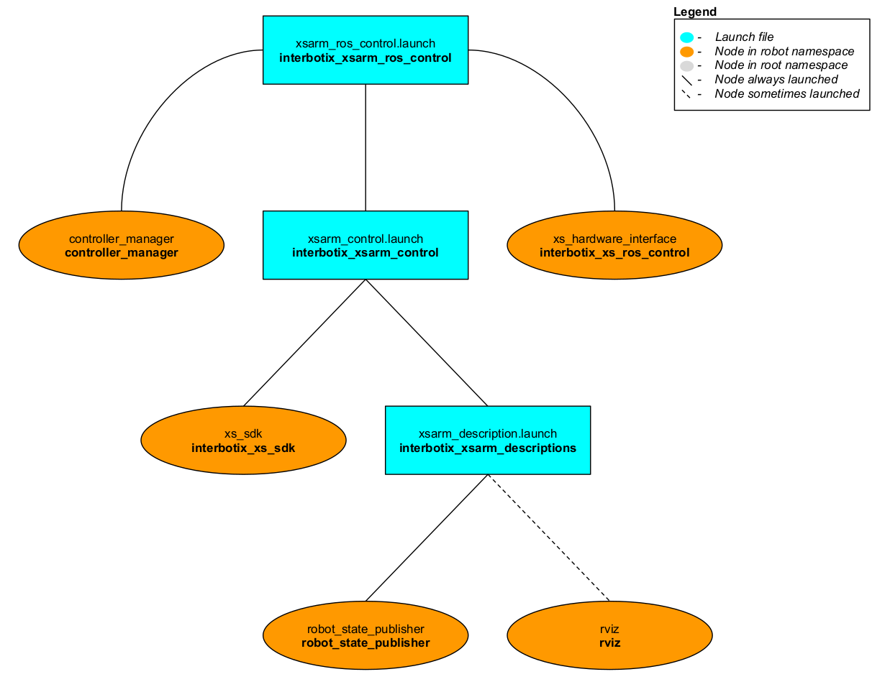

# interbotix_xsarm_ros_control

## Overview
This package provides the necessary ROS controllers needed to get MoveIt to control any physical Interbotix X-Series arm. It essentially takes in Joint Trajectory commands from MoveIt (via the FollowJointTrajectoryAction interface) and then publishes joint commands at the right time to the **xs_sdk** node. Currently, only the 'position' values in the Joint Trajectory messages are used since that provides the smoothest motion. Note that while this package is really only meant to be used with MoveIt, it could technically be used with any other node that can interface properly with the [joint_trajectory_controller](http://wiki.ros.org/joint_trajectory_controller) package.

## Structure

As explained in the Overview, this package builds on top of the *interbotix_xsarm_control* package (which starts the **xs_sdk** node), and is typically used in conjunction with the *interbotix_xsarm_moveit* package. To get familiar with the nodes in those packages, feel free to look at their READMEs. The other nodes are described below:
- **controller_manager** - responsible for loading and starting a set of controllers at once, as well as automatically stopping and unloading those same controllers
- **xs_hardware_interface** - receives joint commands from the ROS controllers and publishes them to the correct topics (subscribed to by the **xs_sdk** node) at the appropiate times

## Usage
This package is not meant to be used by itself but included in a launch file within your custom ROS package (which should expose a FollowJointTrajectoryAction interface).
To run this package, type the line below in a terminal (assuming a PincherX 150 is being launched). Note that if you're using a 4 or 6 dof arm, you should set the `dof` launch file argument appropriately.
```
$ roslaunch interbotix_xsarm_ros_control xsarm_ros_control.launch robot_model:=px150
```
This is the bare minimum needed to get up and running. Take a look at the table below to see how to further customize with other launch file arguments.

| Argument | Description | Default Value |
| -------- | ----------- | :-----------: |
| robot_model | model type of the Interbotix Arm such as 'wx200' or 'rx150' | "" |
| robot_name | name of the robot (typically equal to `robot_model`, but could be anything) | "$(arg robot_model)" |
| base_link_frame | name of the 'root' link on the arm; typically 'base_link', but can be changed if attaching the arm to a mobile base that already has a 'base_link' frame| 'base_link' |
| show_ar_tag | if true, the AR tag mount is included in the 'robot_description' parameter; if false, it is left out; set to true if using the AR tag mount in your project | false |
| use_world_frame | set this to true if you would like to load a 'world' frame to the 'robot_description' parameter which is located exactly at the 'base_link' frame of the robot; if using multiple robots or if you would like to attach the 'base_link' frame of the robot to a different frame, set this to false | true |  
| external_urdf_loc | the file path to the custom urdf.xacro file that you would like to include in the Interbotix robot's urdf.xacro file| "" |
| use_rviz | launches Rviz | false |
| mode_configs | the file path to the 'mode config' YAML file | refer to [xsarm_ros_control.launch](launch/xsarm_ros_control.launch) |
| dof | the degrees of freedom of the arm; while the majority of the arms have 5 dof, others have 4 or 6 dof | 5 |
